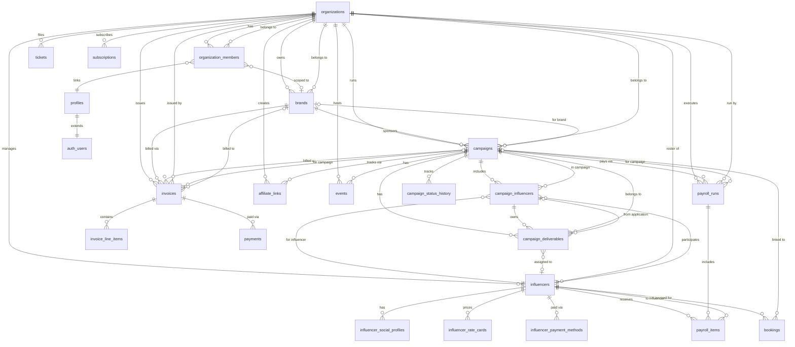

# SCENCE — Data Design Document (DDD)
**Versión:** 1.0 | **Fecha:** 2026-06-03

---

## 1. Modelo de datos — ERD



---

## 2. Tablas — detalle completo

### 2.1 `profiles`
Extiende `auth.users` de Supabase.

| Columna | Tipo | Constraints | Descripción |
|---|---|---|---|
| id | UUID | PK, FK auth.users | Mismo ID que el usuario de Supabase Auth |
| full_name | TEXT | NOT NULL | Nombre completo |
| display_name | TEXT | | Nombre público |
| avatar_url | TEXT | | URL del avatar |
| phone | TEXT | | Teléfono de contacto |
| timezone | TEXT | DEFAULT 'America/Mexico_City' | Zona horaria |
| locale | TEXT | DEFAULT 'es' | Idioma preferido |
| role | user_role ENUM | NOT NULL DEFAULT 'brand_manager' | Rol en el sistema |
| is_active | BOOLEAN | NOT NULL DEFAULT true | ¿Cuenta activa? |
| onboarded_at | TIMESTAMPTZ | | Cuándo completó onboarding |
| last_seen_at | TIMESTAMPTZ | | Última actividad |
| metadata | JSONB | DEFAULT '{}' | Datos extra |
| created_at | TIMESTAMPTZ | NOT NULL DEFAULT NOW() | |
| updated_at | TIMESTAMPTZ | NOT NULL DEFAULT NOW() | Auto-updated |

---

### 2.2 `organizations`
Unidad multi-tenant raíz. Cada instancia de SCENCE para un cliente es una org.

| Columna | Tipo | Constraints | Descripción |
|---|---|---|---|
| id | UUID | PK DEFAULT uuid_generate_v4() | |
| slug | TEXT | UNIQUE NOT NULL | URL-friendly identifier |
| name | TEXT | NOT NULL | Nombre de la organización |
| type | org_type ENUM | NOT NULL DEFAULT 'brand' | brand \| agency |
| logo_url | TEXT | | |
| website | TEXT | | |
| industry | TEXT | | |
| country | TEXT | DEFAULT 'MX' | |
| address | JSONB | DEFAULT '{}' | Dirección postal |
| tax_id | TEXT | | RUT / RFC / NIF |
| billing_email | TEXT | | Email para facturas |
| currency | currency_code ENUM | NOT NULL DEFAULT 'USD' | Moneda base |
| is_active | BOOLEAN | NOT NULL DEFAULT true | |
| settings | JSONB | DEFAULT '{}' | Config custom |
| stripe_customer_id | TEXT | | Stripe Customer |
| stripe_subscription_id | TEXT | | Stripe Subscription |
| subscription_status | TEXT | DEFAULT 'free' | free \| active \| trialing |
| subscription_plan | TEXT | DEFAULT 'free' | free \| pro |
| subscription_period_end | TIMESTAMPTZ | | Fin del período |
| google_access_token | TEXT | | OAuth Google Calendar |
| google_refresh_token | TEXT | | |
| google_token_expiry | TIMESTAMPTZ | | |
| created_at | TIMESTAMPTZ | NOT NULL DEFAULT NOW() | |
| updated_at | TIMESTAMPTZ | NOT NULL DEFAULT NOW() | |

---

### 2.3 `organization_members`
Vincula usuarios a organizaciones con roles.

| Columna | Tipo | Constraints | Descripción |
|---|---|---|---|
| id | UUID | PK | |
| organization_id | UUID | NOT NULL FK organizations | |
| user_id | UUID | NOT NULL FK profiles | |
| role | user_role ENUM | NOT NULL DEFAULT 'brand_manager' | |
| is_owner | BOOLEAN | NOT NULL DEFAULT false | |
| invited_by | UUID | FK profiles | Quién invitó |
| invited_at | TIMESTAMPTZ | | |
| joined_at | TIMESTAMPTZ | | |
| is_active | BOOLEAN | NOT NULL DEFAULT true | |
| brand_id | UUID | FK brands ON DELETE SET NULL | **[NUEVO]** Para multi-seat de marca |
| created_at | TIMESTAMPTZ | NOT NULL DEFAULT NOW() | |
| UNIQUE | (organization_id, user_id) | | |

**Índices:** `idx_org_members_org`, `idx_org_members_user`, `idx_org_members_brand`

---

### 2.4 `brands`
Marca cliente de SCENCE.

| Columna | Tipo | Constraints | Descripción |
|---|---|---|---|
| id | UUID | PK DEFAULT gen_random_uuid() | |
| organization_id | UUID | NOT NULL FK organizations | |
| created_by | UUID | FK auth.users | |
| name | TEXT | NOT NULL | |
| logo_url | TEXT | | |
| website | TEXT | | |
| industry | TEXT | | |
| contact_name | TEXT | | Persona de contacto |
| contact_email | TEXT | | Email de contacto |
| contact_phone | TEXT | | |
| notes | TEXT | | Notas internas SCENCE |
| user_id | UUID | FK auth.users ON DELETE SET NULL | Usuario del portal marca |
| created_at | TIMESTAMPTZ | DEFAULT now() | |
| updated_at | TIMESTAMPTZ | DEFAULT now() | |

**Índices:** `idx_brands_org`, `idx_brands_user_id`

---

### 2.5 `influencers`
Registro de influencer en el roster de una organización.

| Columna | Tipo | Constraints | Descripción |
|---|---|---|---|
| id | UUID | PK | |
| user_id | UUID | UNIQUE FK profiles ON DELETE SET NULL | Si tiene portal |
| organization_id | UUID | FK organizations | Org que lo gestiona |
| display_name | TEXT | NOT NULL | Nombre público |
| bio | TEXT | | Descripción |
| avatar_url | TEXT | | |
| cover_url | TEXT | | |
| email | TEXT | | Privado — no visible a marcas |
| phone | TEXT | | Privado |
| whatsapp | TEXT | | |
| country | TEXT | | |
| city | TEXT | | |
| address | TEXT | | Dirección física (added later) |
| address_lat | NUMERIC(10,7) | | |
| address_lng | NUMERIC(10,7) | | |
| timezone | TEXT | DEFAULT 'America/Mexico_City' | |
| language | TEXT[] | DEFAULT ARRAY['es'] | |
| categories | TEXT[] | DEFAULT ARRAY[]::TEXT[] | fashion, beauty, etc. |
| tags | TEXT[] | DEFAULT ARRAY[]::TEXT[] | |
| gender | TEXT | | |
| age_range | TEXT | | |
| audience_age_range | TEXT | | |
| audience_gender_split | JSONB | | { female: 0.7, male: 0.3 } |
| audience_countries | JSONB | | { MX: 0.5, US: 0.2 } |
| is_verified | BOOLEAN | NOT NULL DEFAULT false | |
| is_active | BOOLEAN | NOT NULL DEFAULT true | |
| rating | NUMERIC(3,2) | DEFAULT 0 | Score 0-5 |
| notes | TEXT | | Notas internas |
| metadata | JSONB | DEFAULT '{}' | |
| created_at | TIMESTAMPTZ | NOT NULL DEFAULT NOW() | |
| updated_at | TIMESTAMPTZ | NOT NULL DEFAULT NOW() | |

**Índices:** `idx_influencers_org`, `idx_influencers_categories` (GIN), `idx_influencers_tags` (GIN)

---

### 2.6 `influencer_social_profiles`
Cuentas en redes sociales por influencer.

| Columna | Tipo | Constraints | Descripción |
|---|---|---|---|
| id | UUID | PK | |
| influencer_id | UUID | NOT NULL FK influencers | |
| platform | social_platform ENUM | NOT NULL | instagram, tiktok, youtube, etc. |
| username | TEXT | NOT NULL | |
| profile_url | TEXT | | |
| followers | INTEGER | DEFAULT 0 | |
| following | INTEGER | DEFAULT 0 | |
| engagement_rate | NUMERIC(5,2) | DEFAULT 0 | Porcentaje |
| avg_likes | INTEGER | DEFAULT 0 | |
| avg_comments | INTEGER | DEFAULT 0 | |
| avg_views | INTEGER | DEFAULT 0 | |
| is_primary | BOOLEAN | NOT NULL DEFAULT false | Red social principal |
| verified | BOOLEAN | NOT NULL DEFAULT false | |
| last_synced_at | TIMESTAMPTZ | | Última sync con Apify |
| synced_at | TIMESTAMPTZ | | Alias para compatibilidad |
| raw_data | JSONB | DEFAULT '{}' | Datos crudos de Apify |
| created_at | TIMESTAMPTZ | | |
| updated_at | TIMESTAMPTZ | | |
| UNIQUE | (influencer_id, platform) | | |

**Índices:** `idx_social_profiles_influencer`, `idx_social_profiles_platform`, `idx_social_profiles_synced`

---

### 2.7 `influencer_rate_cards`
Tarifas del influencer por tipo de entregable.

| Columna | Tipo | Constraints | Descripción |
|---|---|---|---|
| id | UUID | PK | |
| influencer_id | UUID | NOT NULL FK influencers | |
| deliverable_type | deliverable_type ENUM | NOT NULL | instagram_post, reel, etc. |
| base_rate | NUMERIC(12,2) | NOT NULL | Tarifa base |
| currency | currency_code ENUM | NOT NULL DEFAULT 'USD' | CLP en prod |
| includes_usage_rights | BOOLEAN | DEFAULT false | |
| usage_rights_duration_days | INTEGER | | |
| notes | TEXT | | |
| is_active | BOOLEAN | NOT NULL DEFAULT true | |
| created_at / updated_at | TIMESTAMPTZ | | |
| UNIQUE | (influencer_id, deliverable_type) | | |

---

### 2.8 `campaigns`
Campaña de influencer marketing.

| Columna | Tipo | Constraints | Descripción |
|---|---|---|---|
| id | UUID | PK | |
| organization_id | UUID | NOT NULL FK organizations | |
| brand_id | UUID | FK brands ON DELETE SET NULL | Marca patrocinadora |
| created_by_brand_id | UUID | FK brands ON DELETE SET NULL | **[NUEVO]** Marca que creó |
| created_by | UUID | NOT NULL FK profiles | Usuario creador |
| name | TEXT | NOT NULL | |
| description | TEXT | | |
| brief_url | TEXT | | Link a brief externo |
| type | campaign_type ENUM | NOT NULL DEFAULT 'sponsored_post' | |
| status | campaign_status ENUM | NOT NULL DEFAULT 'draft' | Ver estados |
| visibility | TEXT | NOT NULL DEFAULT 'private' CHECK (private\|open) | **[NUEVO]** |
| application_deadline | DATE | | **[NUEVO]** Solo si open |
| max_influencers | INTEGER | | **[NUEVO]** Cupo máximo |
| start_date / end_date | DATE | | |
| budget_total | NUMERIC(14,2) | | Presupuesto total |
| budget_spent | NUMERIC(14,2) | DEFAULT 0 | Gasto acumulado |
| currency | currency_code ENUM | NOT NULL DEFAULT 'CLP' | |
| goals | JSONB | DEFAULT '{}' | KPIs objetivo |
| hashtags | TEXT[] | DEFAULT ARRAY[]::TEXT[] | |
| mention_handles | TEXT[] | DEFAULT ARRAY[]::TEXT[] | |
| platforms | social_platform[] | DEFAULT ARRAY[]::social_platform[] | |
| do_follow_links | TEXT[] | | |
| content_guidelines | TEXT | | Lineamientos de contenido |
| approval_required | BOOLEAN | NOT NULL DEFAULT true | Legacy — ignorar |
| deliverable_templates | JSONB | DEFAULT '[]' | Templates para auto-crear deliverables |
| commission_rate | NUMERIC(5,2) | | % para campañas de comisión |
| internal_notes | TEXT | | |
| tags | TEXT[] | DEFAULT ARRAY[]::TEXT[] | |
| metadata | JSONB | DEFAULT '{}' | |
| created_at / updated_at | TIMESTAMPTZ | | |

**Índices:** `idx_campaigns_org`, `idx_campaigns_status`, `idx_campaigns_dates`, `idx_campaigns_brand`, `idx_campaigns_visibility`, `idx_campaigns_open_deadline`, `idx_campaigns_created_by_brand`

---

### 2.9 `campaign_influencers`
Relación entre campaña e influencer. Representa tanto invitaciones como postulaciones.

| Columna | Tipo | Constraints | Descripción |
|---|---|---|---|
| id | UUID | PK | |
| campaign_id | UUID | NOT NULL FK campaigns | |
| influencer_id | UUID | NOT NULL FK influencers | |
| status | campaign_status ENUM | NOT NULL DEFAULT 'draft' | **LEGACY** — usar application_status |
| application_status | TEXT | NOT NULL DEFAULT 'pending' CHECK (pending\|accepted\|rejected\|expired\|withdrawn) | **[NUEVO]** Estado de la aplicación |
| origin | TEXT | NOT NULL DEFAULT 'invitation' CHECK (invitation\|application) | **[NUEVO]** Cómo llegó |
| message | TEXT | | **[NUEVO]** Mensaje libre |
| deliverables_spec | JSONB | NOT NULL DEFAULT '[]' | **[NUEVO]** Spec acordada al invitar |
| fee | NUMERIC(12,2) | | Tarifa acordada (CLP) |
| currency | currency_code ENUM | NOT NULL DEFAULT 'CLP' | |
| fee_includes_taxes | BOOLEAN | DEFAULT false | |
| payment_terms | TEXT | | |
| usage_rights | TEXT | | |
| exclusivity_days | INTEGER | DEFAULT 0 | |
| invited_at | TIMESTAMPTZ | | |
| accepted_at | TIMESTAMPTZ | | |
| rejected_at | TIMESTAMPTZ | | |
| rejection_reason | TEXT | | |
| notes | TEXT | | |
| created_at / updated_at | TIMESTAMPTZ | | |
| UNIQUE | (campaign_id, influencer_id) | | |

**Índices:** `idx_campaign_influencers_campaign`, `idx_campaign_influencers_influencer`, `idx_campaign_influencers_app_status`, `idx_campaign_influencers_origin`

---

### 2.10 `campaign_deliverables`
Entregables de contenido dentro de una campaña.

| Columna | Tipo | Constraints | Descripción |
|---|---|---|---|
| id | UUID | PK | |
| campaign_id | UUID | NOT NULL FK campaigns | |
| campaign_influencer_id | UUID | FK campaign_influencers | Relación origen |
| influencer_id | UUID | FK influencers | |
| type | TEXT | NOT NULL | Tipo libre (liberado de ENUM en V2) |
| title | TEXT | | |
| description | TEXT | | |
| quantity | INTEGER | NOT NULL DEFAULT 1 | |
| status | deliverable_status ENUM | NOT NULL DEFAULT 'pending' | pending\|in_review\|approved\|rejected\|published |
| due_date | DATE | | Fecha límite |
| published_at | TIMESTAMPTZ | | Cuándo se publicó |
| published_url | TEXT | | URL del post publicado |
| platform | social_platform ENUM | | Instagram, TikTok, etc. |
| caption | TEXT | | Copy sugerido |
| hashtags | TEXT[] | | |
| content_url | TEXT | | URL del contenido a revisar |
| submitted_at | TIMESTAMPTZ | | Cuándo lo entregó el influencer |
| submitted_notes | TEXT | | Notas del influencer |
| review_notes | TEXT | | Notas del revisor |
| reviewed_by | UUID | FK profiles | |
| reviewed_at | TIMESTAMPTZ | | |
| progress | INTEGER | DEFAULT 0 | 0-100 |
| performance | JSONB | DEFAULT '{}' | views, likes, comments post-publicación |
| created_at / updated_at | TIMESTAMPTZ | | |

**Índices:** `idx_deliverables_campaign`, `idx_deliverables_status`, `idx_campaign_deliverables_influencer`

---

### 2.11 `invoices`
Facturas emitidas por SCENCE a sus clientes (brands).

| Columna | Tipo | Constraints | Descripción |
|---|---|---|---|
| id | UUID | PK | |
| invoice_number | TEXT | UNIQUE NOT NULL | SCN-YYYY-NNNN (auto-generado) |
| organization_id | UUID | NOT NULL FK organizations | |
| brand_id | UUID | FK brands | Marca facturada |
| campaign_id | UUID | FK campaigns | |
| issued_by | UUID | NOT NULL FK profiles | |
| status | invoice_status ENUM | NOT NULL DEFAULT 'draft' | |
| subtotal | NUMERIC(14,2) | NOT NULL DEFAULT 0 | |
| tax_rate | NUMERIC(5,2) | DEFAULT 0 | 19% IVA Chile |
| tax_amount | NUMERIC(14,2) | DEFAULT 0 | |
| discount_amount | NUMERIC(14,2) | DEFAULT 0 | |
| total | NUMERIC(14,2) | NOT NULL DEFAULT 0 | |
| currency | currency_code ENUM | NOT NULL DEFAULT 'CLP' | |
| issue_date | DATE | NOT NULL DEFAULT CURRENT_DATE | |
| due_date | DATE | NOT NULL | |
| paid_at | TIMESTAMPTZ | | |
| payment_reference | TEXT | | |
| notes / terms | TEXT | | |
| pdf_url | TEXT | | |
| stripe_invoice_id | TEXT | UNIQUE | |
| metadata | JSONB | DEFAULT '{}' | |
| created_at / updated_at | TIMESTAMPTZ | | |

**Trigger:** `trg_invoice_number` — auto-genera `invoice_number` en INSERT si está vacío.

---

### 2.12 `payroll_runs`
Lote de pagos a influencers.

| Columna | Tipo | Descripción |
|---|---|---|
| id | UUID | PK |
| organization_id | UUID | FK organizations |
| campaign_id | UUID | FK campaigns |
| created_by | UUID | FK profiles |
| title | TEXT | Nombre del lote |
| status | payroll_status ENUM | pending\|approved\|processing\|paid\|failed |
| total_amount | NUMERIC(14,2) | Total del lote |
| currency | currency_code ENUM | DEFAULT 'CLP' |
| approved_by | UUID | FK profiles |
| approved_at / processed_at | TIMESTAMPTZ | |
| period_start / period_end | DATE | |
| notes / metadata | TEXT/JSONB | |

**Trigger:** `trg_budget_spent` — actualiza `campaigns.budget_spent` cuando un `payroll_item` pasa a `paid`.

---

### 2.13 `payroll_items`
Item individual de pago dentro de un payroll_run.

| Columna | Tipo | Descripción |
|---|---|---|
| id | UUID | PK |
| payroll_run_id | UUID | FK payroll_runs |
| influencer_id | UUID | FK influencers |
| campaign_influencer_id | UUID | FK campaign_influencers |
| status | payroll_status ENUM | |
| gross_amount | NUMERIC(12,2) | |
| tax_withholding | NUMERIC(12,2) | DEFAULT 0 |
| platform_fee | NUMERIC(12,2) | DEFAULT 0 |
| net_amount | NUMERIC(12,2) | |
| currency | currency_code ENUM | DEFAULT 'CLP' |
| payment_reference / gateway_payment_id | TEXT | |
| paid_at / failure_reason | TIMESTAMPTZ/TEXT | |

---

### 2.14 `bookings`
Booking de influencer para evento o shoot.

| Columna | Tipo | Descripción |
|---|---|---|
| id | UUID | PK |
| campaign_id | UUID | FK campaigns |
| organization_id | UUID | FK organizations |
| influencer_id | UUID | FK influencers (influencer principal) |
| created_by | UUID | FK profiles |
| title | TEXT | |
| status | booking_status ENUM | proposed\|confirmed\|completed\|canceled\|no_show |
| event_type | TEXT | shoot, event, meeting, live |
| location / location_details | TEXT/JSONB | |
| is_virtual | BOOLEAN | |
| virtual_link | TEXT | |
| starts_at / ends_at | TIMESTAMPTZ | |
| confirmed_at / canceled_at | TIMESTAMPTZ | |
| fee / currency | NUMERIC/ENUM | |
| email_sent_at | TIMESTAMPTZ | Cuando se envió confirmación |
| confirmation_token | TEXT | UNIQUE — para link de confirmación |
| calendar_event_id | TEXT | Google Calendar sync |

**Tabla relacionada:** `booking_influencers` — multi-influencer por booking.  
**Tabla relacionada:** `booking_checkins` — registro de asistencia.

---

### 2.15 `affiliate_links`
Links de seguimiento de conversiones.

| Columna | Tipo | Descripción |
|---|---|---|
| id | UUID | PK |
| organization_id | UUID | FK organizations |
| influencer_id | UUID | FK influencers |
| campaign_id | UUID | FK campaigns |
| code | TEXT | UNIQUE — código del link |
| redirect_url | TEXT | URL destino |
| full_link | TEXT | URL completa con código |
| clicks / conversions | INTEGER | Contadores |
| revenue | NUMERIC(12,2) | Revenue generado |
| commission_rate | NUMERIC(5,2) | % comisión |
| commission_fixed | NUMERIC(12,2) | Comisión fija por conversión |
| currency | TEXT | DEFAULT 'CLP' |
| is_active | BOOLEAN | |

**Track:** `GET /api/track/[code]` — registra click y redirige.

---

### 2.16 `events`
Eventos vinculados a campañas.

| Columna | Tipo | Descripción |
|---|---|---|
| id | UUID | PK |
| organization_id | UUID | FK organizations |
| campaign_id | UUID | FK campaigns |
| name / description | TEXT | |
| event_date | TIMESTAMPTZ | |
| location | TEXT | |
| is_virtual / virtual_link | BOOLEAN/TEXT | |
| capacity | INTEGER | |
| status | TEXT | draft\|published\|canceled\|completed |
| image_url | TEXT | |

---

### 2.17 `tickets`
Bug tracker / soporte interno.

| Columna | Tipo | Descripción |
|---|---|---|
| id | UUID | PK |
| organization_id | UUID | FK organizations |
| created_by | UUID | FK auth.users |
| title / description | TEXT | |
| status | TEXT | open\|in_progress\|closed |
| priority | TEXT | P0\|P1\|P2\|P3 |
| category | TEXT | ui\|api\|data\|auth\|billing\|performance\|other |
| ai_review | JSONB | Análisis de Claude (severity, summary, steps) |

---

### 2.18 `notifications`
Notificaciones in-app (tabla existe, UI pendiente).

| Columna | Tipo | Descripción |
|---|---|---|
| id | UUID | PK |
| recipient_id | UUID | FK profiles |
| type | notification_type ENUM | campaign_update, deliverable_review, payment, etc. |
| title / body | TEXT | |
| action_url | TEXT | |
| is_read | BOOLEAN | DEFAULT false |
| sent_via | TEXT[] | ['email', 'push', 'in_app'] |
| entity_type / entity_id | TEXT/UUID | Referencia a la entidad notificada |

---

## 3. ENUMs

| Enum | Valores |
|---|---|
| user_role | super_admin, agency_manager, brand_manager, influencer, finance |
| org_type | brand, agency |
| subscription_tier | starter, growth, pro, enterprise |
| subscription_status | trialing, active, past_due, canceled, paused |
| campaign_status | draft, pending_approval, active, paused, completed, canceled |
| campaign_type | sponsored_post, event_appearance, ambassador, product_seeding, ugc, live |
| booking_status | proposed, confirmed, completed, canceled, no_show |
| deliverable_type | instagram_post, instagram_story, instagram_reel, tiktok, youtube, youtube_short, blog, podcast, event_appearance, live_stream, ugc_video, ugc_photo |
| deliverable_status | pending, in_review, approved, rejected, published |
| contract_status | draft, sent, signed, expired, voided |
| invoice_status | draft, sent, paid, overdue, void, partially_paid |
| payment_status | pending, processing, completed, failed, refunded |
| payroll_status | pending, approved, processing, paid, failed |
| social_platform | instagram, tiktok, youtube, twitter, facebook, linkedin, pinterest, twitch, snapchat |
| currency_code | USD, EUR, MXN, CLP, COP, ARS, BRL, GBP |
| notification_type | campaign_update, deliverable_review, payment, contract, booking, system |

---

## 4. Triggers y automatizaciones

| Trigger | Tabla | Evento | Acción |
|---|---|---|---|
| `trg_updated_at` | Todas las tablas con `updated_at` | BEFORE UPDATE | SET updated_at = NOW() |
| `trg_invoice_number` | `invoices` | BEFORE INSERT | Auto-genera número SCN-YYYY-NNNN |
| `trg_budget_spent` | `payroll_items` | AFTER UPDATE | Actualiza `campaigns.budget_spent` cuando status → paid |

### Automatizaciones en código (no DB triggers)

| Automatización | Dónde | Trigger | Acción |
|---|---|---|---|
| Auto-crear deliverables | `PATCH /api/brand/campaigns/[id]/applications` | application_status → accepted | INSERT campaign_deliverables desde deliverables_spec |
| Activar campaña | `PATCH /api/brand/campaigns/[id]/applications` | Primer influencer aceptado + campaign.status=draft | UPDATE campaigns.status → active |
| Auto-crear deliverables (admin) | `PATCH /api/campaigns/[id]/influencers` | status → active | INSERT desde deliverable_templates |
| Auto-crear tasks | `POST /api/campaigns/[id]/influencers` | Add influencer | createInfluencerTasks() |
| Sync deliverable tasks | `POST /api/campaigns/[id]/influencers` | Add influencer | syncDeliverableTask() |
| Crear brands record | `POST /api/brand/register` | Primer login de marca | INSERT brands si no existe |
| Crear org | `ensureOrg()` | Primer login de admin | INSERT organizations + organization_members |

---

## 5. Índices completos

```sql
-- Organizations
idx_org_members_org               organizations_members(organization_id)
idx_org_members_user              organization_members(user_id)
idx_org_members_brand             organization_members(brand_id) WHERE brand_id IS NOT NULL
idx_organizations_stripe_customer organizations(stripe_customer_id) WHERE NOT NULL
idx_organizations_subscription_status organizations(subscription_status) WHERE NOT NULL

-- Brands
idx_brands_org                    brands(organization_id)
idx_brands_user_id                brands(user_id) WHERE NOT NULL

-- Influencers
idx_influencers_org               influencers(organization_id)
idx_influencers_categories        influencers USING gin(categories)
idx_influencers_tags              influencers USING gin(tags)
idx_social_profiles_influencer    influencer_social_profiles(influencer_id)
idx_social_profiles_platform      influencer_social_profiles(platform)
idx_social_profiles_synced        influencer_social_profiles(synced_at) WHERE NOT NULL

-- Campaigns
idx_campaigns_org                 campaigns(organization_id)
idx_campaigns_status              campaigns(status)
idx_campaigns_dates               campaigns(start_date, end_date)
idx_campaigns_brand               campaigns(brand_id) WHERE NOT NULL
idx_campaigns_visibility          campaigns(visibility)
idx_campaigns_open_deadline       campaigns(application_deadline) WHERE visibility='open' AND NOT NULL
idx_campaigns_created_by_brand    campaigns(created_by_brand_id) WHERE NOT NULL

-- Campaign Influencers
idx_campaign_influencers_campaign  campaign_influencers(campaign_id)
idx_campaign_influencers_influencer campaign_influencers(influencer_id)
idx_campaign_influencers_app_status campaign_influencers(application_status)
idx_campaign_influencers_origin    campaign_influencers(origin)

-- Deliverables
idx_deliverables_campaign         campaign_deliverables(campaign_id)
idx_deliverables_status           campaign_deliverables(status)
idx_campaign_deliverables_influencer campaign_deliverables(influencer_id)

-- Bookings
idx_bookings_influencer           bookings(influencer_id)
idx_bookings_campaign             bookings(campaign_id)
idx_bookings_dates                bookings(starts_at, ends_at)
idx_bookings_status               bookings(status)
idx_booking_influencers_booking   booking_influencers(booking_id)
idx_booking_influencers_influencer booking_influencers(influencer_id)

-- Billing
idx_invoices_org                  invoices(organization_id)
idx_invoices_status               invoices(status)
idx_invoices_campaign             invoices(campaign_id)
idx_payments_invoice              payments(invoice_id)

-- Payroll
idx_payroll_runs_org              payroll_runs(organization_id)
idx_payroll_items_run             payroll_items(payroll_run_id)
idx_payroll_items_influencer      payroll_items(influencer_id)

-- Notifications
idx_notifications_recipient       notifications(recipient_id, is_read)
idx_notifications_entity          notifications(entity_type, entity_id)

-- Audit
idx_audit_actor                   audit_logs(actor_id)
idx_audit_entity                  audit_logs(entity_type, entity_id)
idx_audit_org                     audit_logs(organization_id)
idx_audit_created                 audit_logs(created_at DESC)

-- Tickets
idx_tickets_org_id                tickets(organization_id)
idx_tickets_status                tickets(organization_id, status)
idx_tickets_created_at            tickets(organization_id, created_at DESC)

-- Affiliate
idx_affiliate_org                 affiliate_links(organization_id)
idx_affiliate_code                affiliate_links(code)
idx_affiliate_influencer          affiliate_links(influencer_id)
idx_affiliate_links_active        affiliate_links(organization_id) WHERE is_active = true
```

---

## 6. Tablas futuras recomendadas

| Tabla | Descripción | Prioridad |
|---|---|---|
| `campaign_comments` | Comentarios de marca en deliverables | Alta |
| `influencer_invitations` | Tabla separada para invitaciones pendientes (actualmente en campaign_influencers) | Media |
| `notification_preferences` | Config de notificaciones por usuario | Media |
| `brand_team_invitations` | Invitaciones pendientes a equipo de marca | Media |
| `campaign_reports` | Cache de reportes generados | Baja |
| `influencer_reviews` | Reviews de marcas a influencers | Baja |
| `contract_templates` | Ya existe | — |
