**SCENCE — Functional Design Document**

**Plataforma de gestión de campañas de influencer marketing**

**Versión:** 2.1 | **Fecha de emisión:** 2026-07-02

---

## Control de Documento

### Lista de distribución

| Nombre | Rol |
|---|---|
| Priscilla Perez | Founder / Product Owner |
| Equipo SCENCE | Operaciones / Desarrollo |

### Historial de cambios

| Versión | Detalle del cambio | Fecha |
|---|---|---|
| 1.0 | Versión inicial del FDD | (previa a esta auditoría) |
| 2.0 | Auditoría en vivo contra producción (`scence-app.vercel.app`), 3 portales, 25 pantallas documentadas con mockups fieles, 9 bugs encontrados | 2026-07-01 |
| 2.1 | Reestructurado a formato ejecutivo (control de documento, mapa de proceso, requisitos funcionales por portal, reportes, no-funcionales, notificaciones, glosario). Se corrigieron 6 de los 9 bugs encontrados (ver §12, Bugs) | 2026-07-01 |
| 2.1 (deploy) | Los 6 fixes + reestructuración se pushearon a producción. Un fix (eliminación de `CampaignDetailView.brand.tsx`) se basó en un diagnóstico incorrecto y rompió el build; detectado vía Vercel antes de afectar usuarios, corregido y repusheado el mismo día. Se agrega hallazgo G-16 (ver Anexo C) | 2026-07-01 |
| 2.1 (revisión Pri) | Pri revisó el FDD y reportó un problema real en BR-04 (comentario en Google Docs): tareas fantasma sin relación a deliverables. Se diagnosticó, corrigió el código (bug B-10) y se limpiaron 412 filas ya existentes en producción, con aprobación explícita de Pri para el alcance del borrado | 2026-07-01 |
| 2.1 (flujo open) | Pri pidió auditar de punta a punta el flujo de campaña pública/open (crear → ver → postular → aprobar → deliverables → tareas → email → visibilidad). Se encontró bug B-11 (faltaba sync de tareas + email al aprobar) y se corrigió, acotado a `PATCH /api/brand/campaigns/[id]/applications`. Resto del flujo confirmado correcto sin cambios | 2026-07-01 |
| 2.1 (roles) | Pri confirmó por comentario en el FDD que `agency_manager` no es un rol real ("no existe"). Se auditó su uso real: solo 2 perfiles de prueba, 5 RLS policies, 10 archivos de código, y el trigger de signup lo asignaba por defecto (aunque `ensureOrg()` ya lo sobreescribía a `brand_manager` en casi todos los casos). Se reasignaron los 2 perfiles a `super_admin`, se corrigió el trigger, se actualizaron las 5 RLS y los 10 archivos, sin dropear el valor del enum en Postgres (innecesario). Modelo de roles vigente: `super_admin` / `brand_manager` / `influencer` | 2026-07-01 |
| 2.1 (billing) | Pri pidió planes de suscripción para Marca iguales a "Montu" (Starter/Plus/Enterprise), con pasarela de pago real. Se encontraron 2 sistemas de billing ya existentes y desconectados: `organizations.subscription_*` + Stripe checkout/webhook/portal hardcodeados a un solo plan "pro" (nunca conectado a UI), y `subscription_plans`/`subscriptions` (multi-tier, desde baseline, 0 filas, sin API/UI). Se consolidó todo sobre el segundo (ya soportaba multi-tier); el primero se adaptó para ser plan-aware en vez de duplicarse. Cierra MK-12 (`brand-billing` ya no es "soon") | 2026-07-01 |
| 2.1 (ranking filtrable) | Pri pidió (parking lot de sesiones previas) que agregar influencers a una campaña privada reutilice el ranking existente con filtros (comuna, fecha, campañas colaboradas) en vez de una vista reducida paralela. Auditoría encontró que `AddInfluencerClient.tsx` tenía su propia tabla ad-hoc (solo búsqueda libre). Se agregó una prop opcional `renderAction` a `InfluencerRanking` (columna de acción por fila) y se reemplazó la tabla ad-hoc, heredando sort por comuna/campañas/entregables/rating y filtro por plataforma/última conexión ya existentes, sin alterar el ranking admin general (prop opcional) | 2026-07-01 |
| 2.1 (permisos marca) | Durante la auditoría del punto anterior se revisó también `brand-campaigns/[id]/invite`. Se encontró y corrigió un hallazgo de seguridad real: `GET /api/brand/influencers/[id]` — ver B-15 | 2026-07-01 |
| 2.1 (notificar influencers) | Se retomó el parking lot de emailear a las mejores influencers cuando se publica una campaña pública. Pri simplificó el alcance a un botón manual (no automático) en batches de 50 por click, ordenado por seguidores. Construido en AD-04 (Admin), cierra el parking lot. De paso se encontró y corrigió B-16 (toggle de visibilidad con valores incorrectos) en el mismo archivo | 2026-07-01 |
| 2.1 (UAT + hardening) | UAT real del fix B-11 (Pri aceptó una postulación real, sync de tareas y deliverables confirmado con datos de producción). Encontrado y corregido de paso: crash de cliente en `/inf-campaign/[id]` para cualquier campaña asignada (tipo `campaign_deliverables` mal anidado), y errores silenciosos de Resend en 7 de 12 call-sites de email (SDK no lanza excepción en fallos de API). Se agregó badge de postulaciones pendientes al nav "Campañas" y se corrigió B-19 (tabla `InfluencerRanking` recortaba columnas/botón sin scroll). Se agregaron filtros de categoría y campaña participada al ranking compartido (Admin + Marca) | 2026-07-02 |

### Sign-off

| Versión | Nombre | Rol | Fecha | Firma |
|---|---|---|---|---|
| | | | | |

---

## 1. Introducción

Este Functional Design Document (FDD) documenta el diseño funcional de SCENCE tal como existe hoy en producción, verificado mediante auditoría en vivo (sesiones reales en los 3 portales, sin modificar datos) el 2026-07-01. No es una propuesta — es un registro fiel del sistema real, sus reglas de negocio, sus bugs conocidos y las decisiones de producto pendientes.

### 1.1 Resumen del producto

SCENCE es una plataforma SaaS B2B de gestión de campañas de influencer marketing. Permite a agencias de marketing y marcas gestionar el ciclo completo de una campaña: búsqueda y contratación de influencers, aprobación de contenido, facturación y pago.

| | |
|---|---|
| **Producto** | Plataforma multi-portal (Admin, Marca, Influencer) |
| **URL producción** | https://scence-app.vercel.app |
| **Stack** | Next.js 14 (App Router), Supabase (Postgres + Auth + RLS), Vercel |
| **Moneda base** | CLP (Peso chileno) |
| **Base de datos** | Supabase project `xzzbishzfyovrladcaeb`, Postgres 17 |

### 1.2 Objetivos

1. **Centralizar** la gestión de campañas de influencer marketing en un solo sistema.
2. **Automatizar** el flujo de trabajo: invitación → aceptación → entregables → aprobación → pago.
3. **Self-service** para marcas: crear campañas y contratar influencers sin intermediación obligatoria.
4. **Transparencia** para influencers: ver campañas, entregar contenido y ver pagos.
5. **Control** para el admin de SCENCE: visibilidad total, capacidad de intervención sin ser cuello de botella.
6. **Escalabilidad** SaaS: múltiples organizaciones/clientes sobre la misma base de código.

### 1.3 Impacto de arquitectura legacy

El producto migró sus rutas de un esquema sin prefijo (`/campaigns`, `/brand/campaigns`, `/dashboard`) a prefijos por portal (`admin-*`, `brand-*`, `inf-*`). Las rutas viejas siguen existiendo únicamente como alias de redirect en `src/middleware.ts` por seguridad — no son UI activa. Varios de los bugs encontrados en esta auditoría (ver Anexo A) son residuos de esa migración: links en el frontend que quedaron apuntando a la ruta legacy en vez de la nueva.

---

## 2. Requisitos de Negocio

La siguiente tabla resume las reglas de negocio activas del sistema — el equivalente a los "requisitos" de un proyecto de configuración, pero registrados aquí como reglas ya implementadas y verificadas contra el código real.

| ID | Regla | Descripción |
|---|---|---|
| BR-01 | Multi-tenancy | Todo dato está scoped por `organization_id`, reforzado en cada query server-side. |
| BR-02 | Roles de usuario | `super_admin` → Admin (ve todo); `is_brand=true` → Marca (`brand_manager`, owner); `is_influencer=true` → Influencer (sin sub-roles). `src/middleware.ts` enforza el routing por rol vía listas `ADMIN_ONLY`/`BRAND_ONLY`/`INFLUENCER_ONLY`. **Corregido 2026-07-01:** el rol `agency_manager` existía en el enum y en RLS/código (2 perfiles reales, ambos de prueba) pero no correspondía a ninguna persona del modelo de producto real; se eliminó de todo uso activo (ver changelog). |
| BR-03 | Campañas private vs. open | `private`: la marca agrega influencers por invitación. `open`: los influencers postulan y la marca decide. |
| BR-04 | Auto-creación de deliverables | Al aceptar invitación/postulación (o al agregar un influencer a una campaña) se crean automáticamente los `campaign_deliverables` desde la plantilla de la campaña; la campaña pasa a `active`. Cada deliverable sincroniza 1:1 una `influencer_task` vinculada (`deliverable_id`) — es la única fuente de "tareas" que debe ver el influencer. **Corregido el 2026-07-01 (bug B-10):** antes también se creaban 4 tareas genéricas sin vincular a ningún deliverable real; ver Anexo A. |
| BR-05 | `deliverables_spec` inmutable | Una vez creada la invitación, no se modifica — es el "contrato informal". Los `campaign_deliverables` son la fuente de verdad operacional. |
| BR-06 | Visibilidad entre portales | La marca no ve: email/teléfono de influencers, tarifas históricas con otras marcas, campañas de otras marcas, base completa de influencers, notas internas, payroll interno. El influencer no ve: tarifas de otros influencers ni datos financieros de campaña. |
| BR-07 | Status de campaña | Pasa a `active` con el primer influencer aceptado. No se puede invitar sobre campañas `completed`/`canceled`. |
| BR-08 | IVA en facturación | Todas las facturas incluyen IVA 19% (Chile): `tax_amount = subtotal * 0.19`. |
| BR-09 | Moneda CLP | Moneda por defecto en toda la UI (el schema soporta otras vía `currency_code`). |
| BR-10 | Brand self-registration | `/register/brand` auto-crea `brands` vinculado a la organización SCENCE. Primer login dispara `POST /api/brand/register`. |
| BR-11 | Middleware como última línea de defensa | El middleware bloquea correctamente el acceso cruzado entre portales incluso cuando el frontend expone un link/botón indebido (caso bug B-08) — pero eso no exime de limpiar la UI. |

### 2.1 Mapa de Proceso

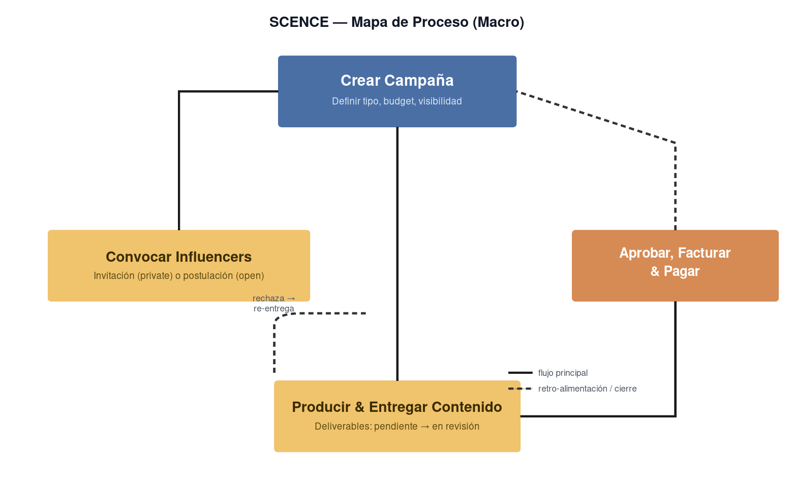

El flujo macro del negocio: se define la campaña, se convoca al elenco de influencers (por invitación directa o postulación abierta), se produce y aprueba el contenido (con retro-alimentación si se rechaza), y se cierra el ciclo con facturación y pago — cuyo cierre alimenta la siguiente campaña.

### 2.2 Flujo de Sistema (arquitectura)

```
Usuario ──▶ Next.js 14 (App Router, Vercel)
              │
              ├─ middleware.ts → enforza rol (admin-*/brand-*/inf-*)
              │
              ├─ Supabase Auth → sesión + user_metadata (is_brand, is_influencer)
              │
              └─ Supabase Postgres (RLS + admin client server-side)
                    │
                    ├─ campaigns, campaign_influencers, campaign_deliverables
                    ├─ influencers, influencer_social_profiles, brands
                    ├─ invoices, payroll_runs, bookings, contract_templates
                    ├─ affiliate_links, support_tickets, locations, organizations
                    │
      Integraciones externas:
        Google Calendar (Service Account) — bookings
        Apify — sync de métricas de Instagram
        Resend — emails transaccionales
        Stripe — scaffold presente, checkout no activo
```

### 2.3 Supuestos

1. El equipo de SCENCE (Admin) actúa como agencia intermediaria y como operador de la plataforma a la vez.
2. Las marcas se auto-registran y operan en modo self-service; el Admin puede intervenir en cualquier campaña.
3. Los influencers son gestionados centralmente por el roster de SCENCE (Admin), no por cada marca individualmente.
4. La moneda de referencia para toda la operación comercial es CLP.
5. El middleware de Next.js es la capa de control de acceso entre portales; el frontend debe reflejar esas restricciones en la UI, no reemplazarlas.

### 2.4 Restricciones

- Sin app móvil nativa.
- Cobro a marcas vía Stripe: UI y código plan-aware activos (MK-12); cobro real pendiente de Price IDs y API keys de producción.
- Sin firma electrónica de contratos (DocuSign).
- Sin tracking de performance post-publicación en tiempo real (views/likes).
- Sin marketplace público de influencers.
- Configuración → Usuarios (gestión de equipo real) y Billing/Marcas colaboradoras de Marca: pendientes de decisión de producto (ver Anexo A y §7 Datos e Importación).

---
## 3. Requisitos Funcionales por Portal

> Los mockups son reconstrucciones fieles (SVG, no screenshots literales) generadas a partir de la sesión en vivo del 2026-07-01, en `docs/mockups/*.svg`.

### 3.1 Portal Admin

Acceso: `role: super_admin`. Rutas: `admin-*`. Equipo interno de SCENCE — acceso total a todos los datos de la plataforma.

#### AD-01 Dashboard
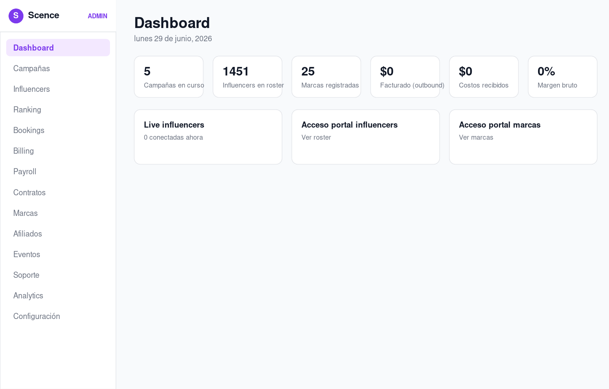

**Navegación:** `admin-dash` · **API:** `GET /api/dashboard` · **Tablas:** `campaigns`, `influencers`, `brands`, `invoices`, `payroll_runs`, `campaign_deliverables`

| Campo | Fuente | Para qué sirve |
|---|---|---|
| Campañas en curso | `count(campaigns) where status in (active,pending_influencers)` | KPI de carga operativa del mes |
| Influencers en roster | `count(influencers) where is_active=true` | Tamaño total del roster disponible |
| Marcas registradas | `count(brands)` | Tamaño de la cartera de clientes |
| Facturado (outbound) | `sum(invoices.total)` del mes | Ingreso reconocido |
| Costos recibidos | `sum(payroll_runs.total)` del mes | Costo de payroll del mes |
| Margen bruto | `facturado - costos` | Rentabilidad rápida |
| Live influencers | Placeholder (siempre 0 hoy) | Feature futura de "conectados ahora" |

**Regla:** todo se filtra por `organization_id` del usuario.

#### AD-02 Lista de Campañas
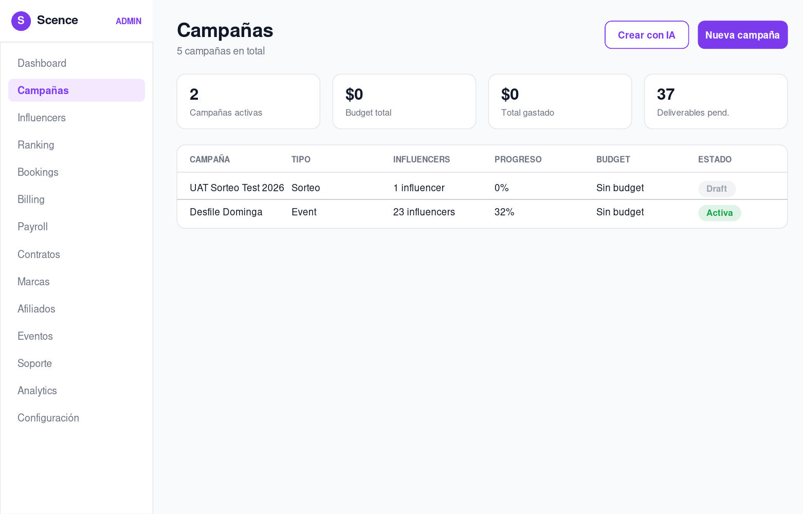

**Navegación:** `admin-campaigns` · **API:** `GET /api/campaigns` · **Tablas:** `campaigns`, `brands`, `campaign_influencers`, `campaign_deliverables`

| Campo | Fuente | Para qué sirve |
|---|---|---|
| KPIs (activas, budget total, gastado, deliverables pend.) | Agregados server-side | Cabecera de control |
| Campaña / Tipo / Influencers / Progreso / Budget / Fechas / Estado | `campaigns.*` join `campaign_influencers`, `campaign_deliverables` | Fila de tabla completa |
| Filtros (tipo, plataforma, fecha, estado) | Query params sobre `/api/campaigns` | Búsqueda server-side |

**Acciones:** Nueva campaña, Crear con IA (AI Campaign Builder vía Claude Haiku), abrir detalle, filtrar.

#### AD-03 Nueva Campaña (wizard 4 pasos)
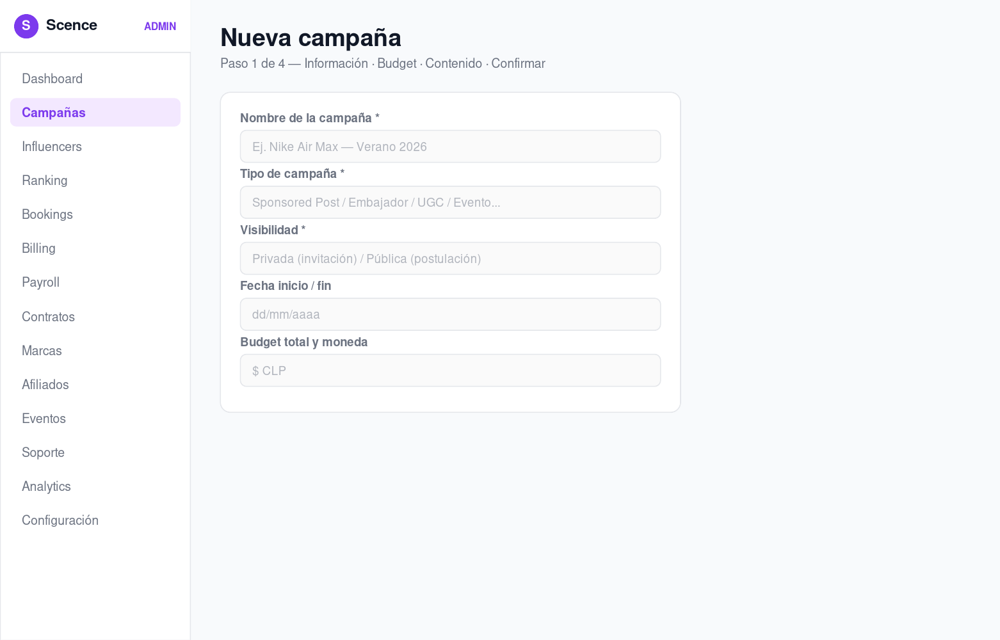

**Navegación:** `admin-campaigns/new` — mismo componente `CampaignForm.tsx` que usa Marca (`brand-campaigns/new`), API distinta por portal.

| Campo | Paso | Para qué sirve |
|---|---|---|
| Nombre * | 1 Información | Identificador visible |
| Descripción | 1 | Brief interno |
| Tipo * | 1 | Sponsored Post / Embajador / UGC / Evento / Product Seeding / Live |
| Visibilidad * | 1 | `private` (invitación) vs `open` (postulación) — BR-03 |
| Fechas inicio/fin | 2 Budget | Ventana de ejecución |
| Budget + Moneda | 2 | Techo de gasto (CLP) |
| Comisión % | 2 | Margen de agencia sobre budget |
| Plataformas / Hashtags / Menciones | 3 Contenido | Specs de publicación |
| Guía de contenido | 3 | Tono/estilo para el influencer |
| Deliverables (tags) | 3 | Plantilla de entregables sugeridos |
| Resumen | 4 Confirmar | Revisión antes de crear (`status=draft`) |

#### AD-04 Detalle de Campaña
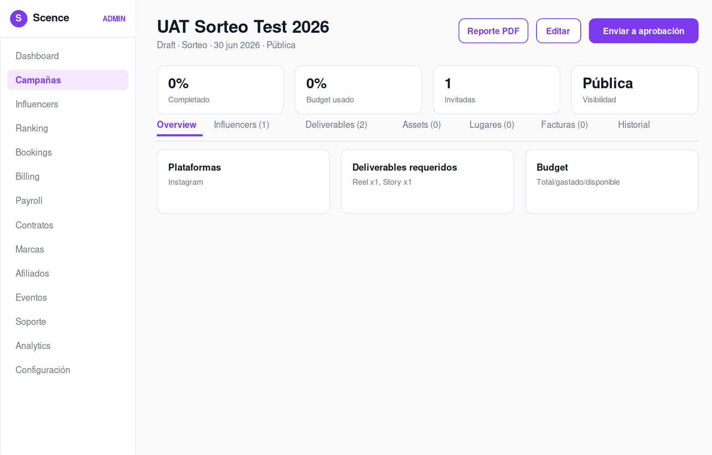

**Navegación:** `admin-campaigns/[id]` · **Tabs:** Overview · Influencers · Deliverables · Assets · Lugares · Facturas · Historial

| Campo | Fuente | Para qué sirve |
|---|---|---|
| Header (nombre, estado, tipo, fechas, visibilidad) | `campaigns.*` | Identificación rápida |
| % Completado / % Budget usado | Derivado de `campaign_deliverables`, `budget_total` | Salud de campaña |
| Tab Influencers | `campaign_influencers` join `influencers` | Gestión de elenco |
| Tab Deliverables | `campaign_deliverables` | Aprobar/rechazar contenido |
| Tab Facturas | `invoices` filtradas por `campaign_id` | Trazabilidad financiera |
| Tab Historial | Audit log de cambios de estado | Trazabilidad de decisiones |

**Reusado por Marca:** `brand-campaigns/[id]` reutiliza este mismo componente (`CampaignDetail`), filtrado por permisos — ver 3.2.

**Notificar influencers (solo Admin, campañas `visibility=open`):** botón manual "Notificar siguiente batch" · **API:** `POST /api/campaigns/[id]/notify-influencers` · **Tabla:** `campaign_influencer_notifications`. Construido 2026-07-01 (cierra el parking lot de email batch a top influencers). Cada click envía email (`campaignOpenAvailableEmail`) a hasta 50 influencers activas con email, ordenadas por seguidores descendente, excluyendo a quienes ya están en la campaña o ya fueron notificadas antes — así el botón avanza al siguiente batch en cada click, sin repetir destinatarios. No visible en el portal Marca (acción admin-only, similar a por qué Marca no ve el roster completo — BR-06).

#### AD-05 Lista de Influencers
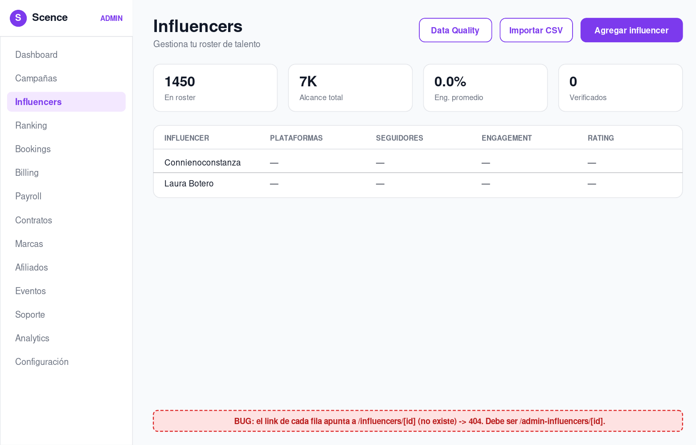

**Navegación:** `admin-influencers` (1.450 registros) · **Tablas:** `influencers`, `influencer_social_profiles`

| Campo | Fuente | Para qué sirve |
|---|---|---|
| Nombre / avatar | `influencers.display_name, avatar_url` | Identificación |
| Plataformas / seguidores / engagement | `influencer_social_profiles` | Evaluación de fit |
| Rating | `influencers.rating` (histórico de campañas) | Calidad de colaboración |
| Email / teléfono | `influencers.email, phone` | Contacto directo (solo Admin — BR-06) |
| Tarifas históricas | `influencer_rate_cards` | Referencia de negociación (solo Admin — BR-06) |

**Estado:** ✅ corregido en v2.1 — bug B-01 (link roto a `/influencers/[id]`) resuelto, ver Anexo A.

#### AD-06 Perfil de Influencer
**Navegación:** `admin-influencers/[id]` · **Tabla:** `influencers`

Ficha completa: datos de contacto, redes sociales, historial de campañas, tarifas, notas internas (solo visibles para Admin).

#### AD-07 Data Quality
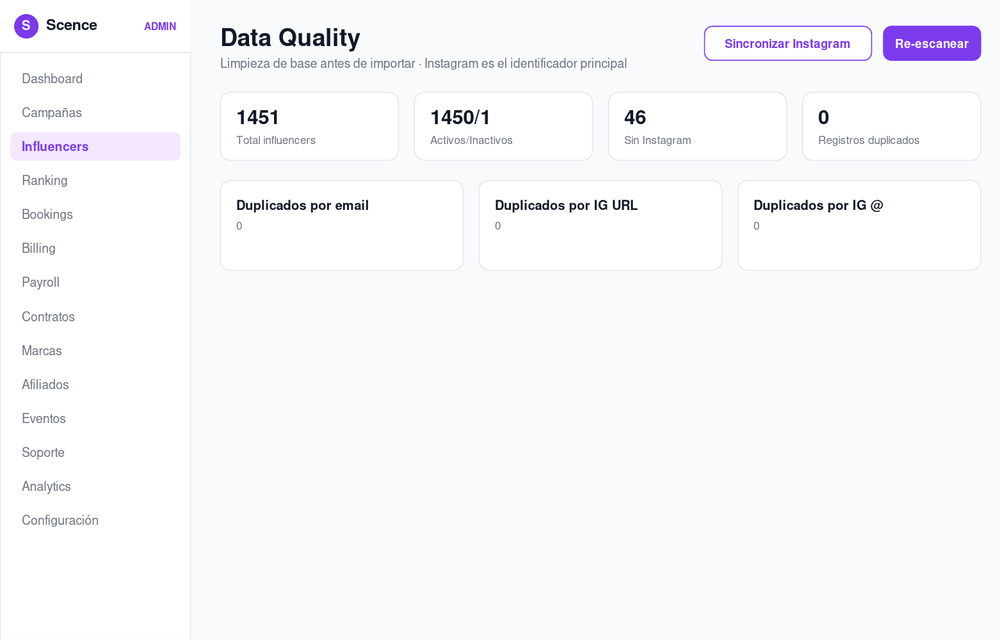

**Navegación:** `admin-influencers/data-quality` · **API:** `GET /api/influencers/duplicates`, `POST /api/influencers/merge`, `DELETE /api/influencers/bulk-delete`, `POST /api/influencers/sync-instagram`

| Campo | Fuente | Para qué sirve |
|---|---|---|
| Total / Activos-Inactivos / Sin Instagram | Agregados sobre `influencers` | Salud de la base |
| Duplicados por email / IG URL / IG @ | Detección server-side por coincidencia exacta | Limpieza antes de importar |
| Sincronizar Instagram | Llama Apify actor | Métricas frescas |

#### AD-08 Ranking de Influencers
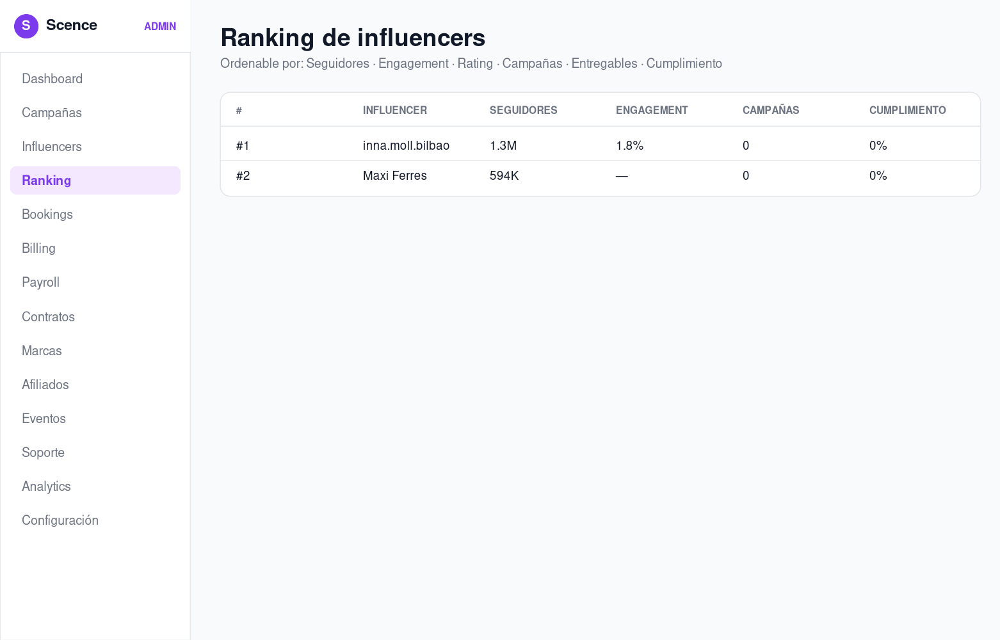

**Navegación:** `admin-influencers/ranking`

| Campo | Fuente | Para qué sirve |
|---|---|---|
| Seguidores / Engagement / Rating | `influencer_social_profiles`, `influencers.rating` | Ordenar por criterio de negocio |
| Campañas / Entregables / Cumplimiento | `campaign_influencers`, `campaign_deliverables` | Desempeño histórico real |

#### AD-09 Lista y Detalle de Marcas
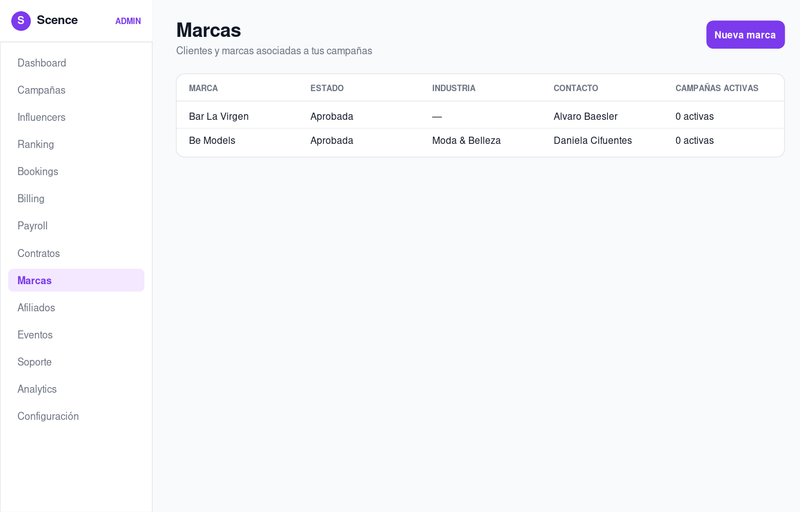 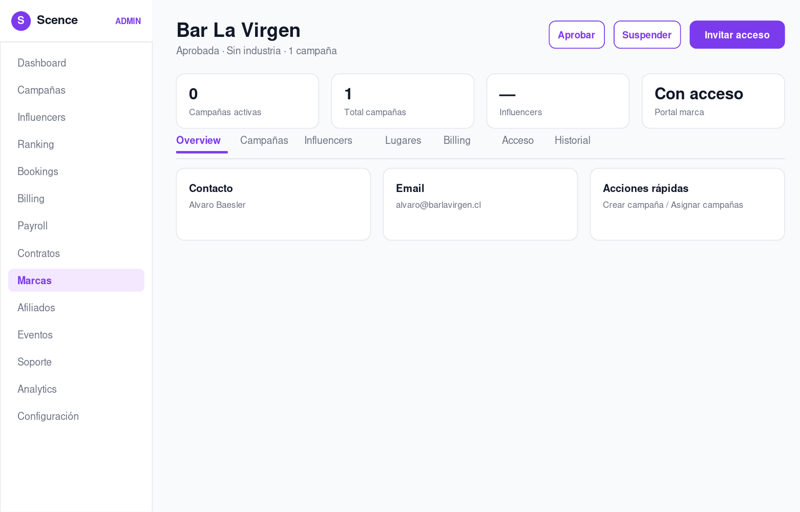

**Navegación:** `admin-brands`, `admin-brands/[id]` · **Tabs:** Overview · Campañas · Influencers · Lugares · Billing · Acceso · Historial

| Campo | Fuente | Para qué sirve |
|---|---|---|
| Estado (Aprobada/Pendiente/Suspendida) | `brands.status` | Control de acceso al portal marca |
| Industria / Contacto / Email | `brands.*` | Ficha comercial |
| Campañas activas / totales | `campaigns where brand_id` | Volumen de negocio |
| Tab Acceso | `auth.users` vinculados | Invitar/gestionar acceso |
| Aprobar / Suspender | `PATCH brands.status` | Gate de acceso al portal marca |

#### AD-10 Bookings
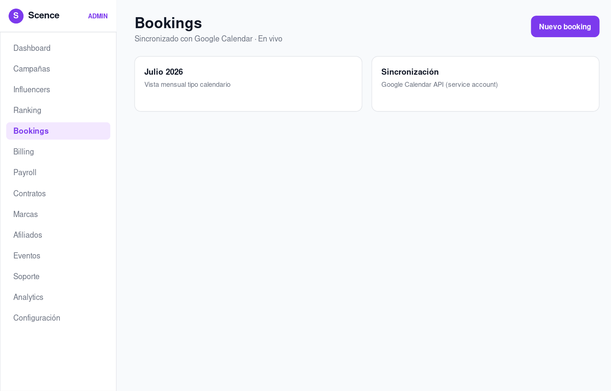

**Navegación:** `admin-bookings` · **API:** `lib/google-calendar.ts` (Service Account) · **Tabla:** `bookings`

Vista mensual/lista sincronizada con Google Calendar. Agenda operativa de apariciones/eventos.

#### AD-11 Billing (Facturas + Payroll)
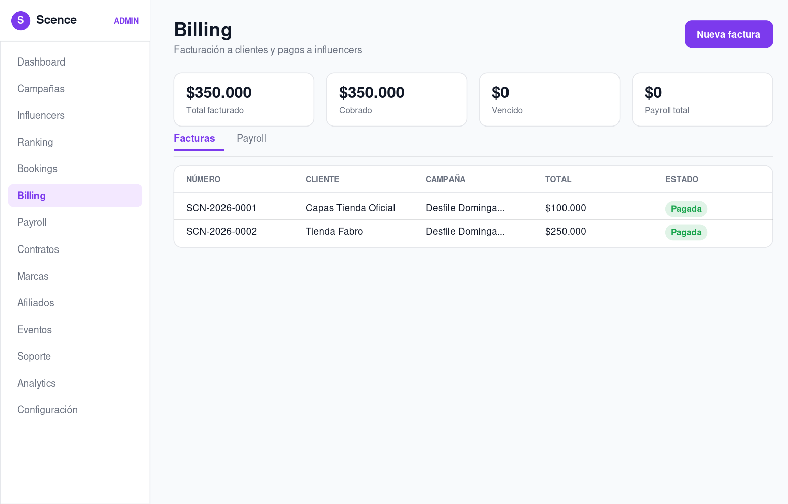

**Navegación:** `admin-billing` (tabs Facturas/Payroll; `admin-payroll` redirige aquí) · **Tablas:** `invoices`, `payroll_runs`

| Campo | Fuente | Para qué sirve |
|---|---|---|
| Total facturado / cobrado / vencido | Agregados sobre `invoices` | Salud de cobranza |
| Payroll total | `sum(payroll_runs)` | Costo total a influencers |
| Tabla Facturas | `invoices.*` join `brands`, `campaigns` | Gestión de cobranza (IVA 19% — BR-08) |

#### AD-12 Contratos
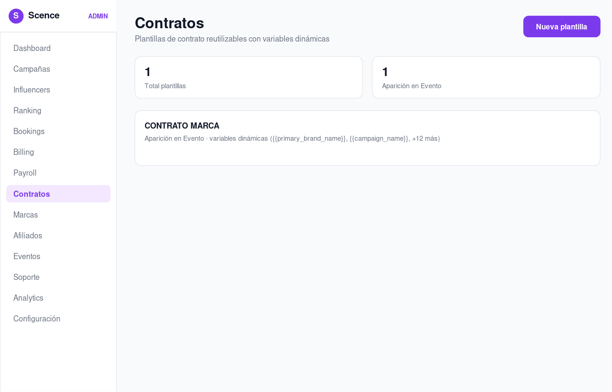

**Navegación:** `admin-contracts` · **Tabla:** `contract_templates` (variables `{{primary_brand_name}}`, `{{campaign_name}}`, etc.)

Plantillas de contrato reutilizables por tipo de campaña, con variables dinámicas.

#### AD-13 Afiliados
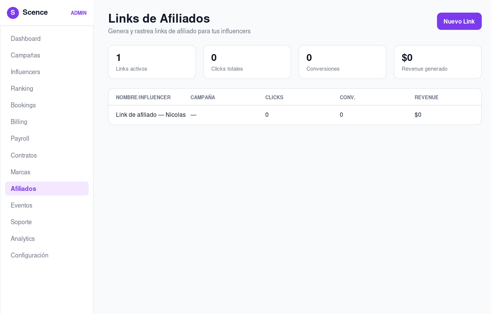

**Navegación:** `admin-affiliates` · **API:** `/api/affiliates`, `/api/track/[code]` · **Tabla:** `affiliate_links`

Links activos, clicks, conversiones y revenue por link de afiliado.

#### AD-14 Eventos & Entradas
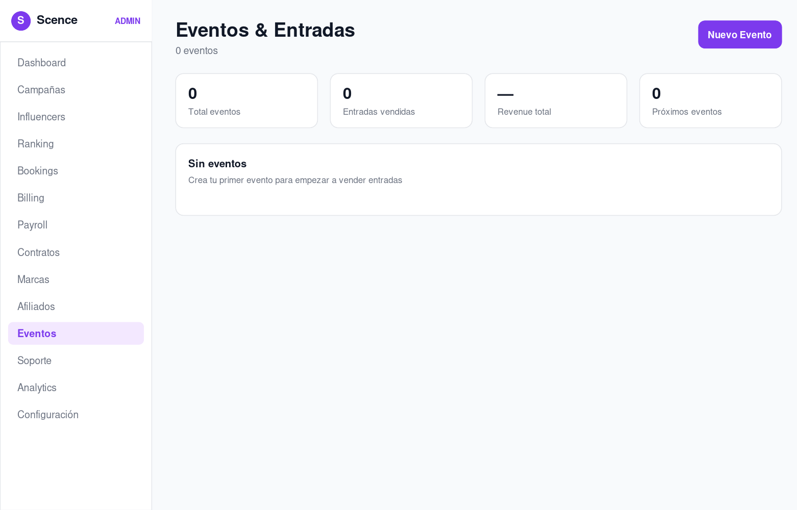

**Navegación:** `admin-events`, `admin-events/[id]` · **API:** `/api/events`, `/api/events/[id]/tickets`, `/api/events/[id]/sales`

Módulo de venta de entradas para activaciones tipo evento: total eventos, entradas vendidas, revenue, próximos.

#### AD-15 Analytics
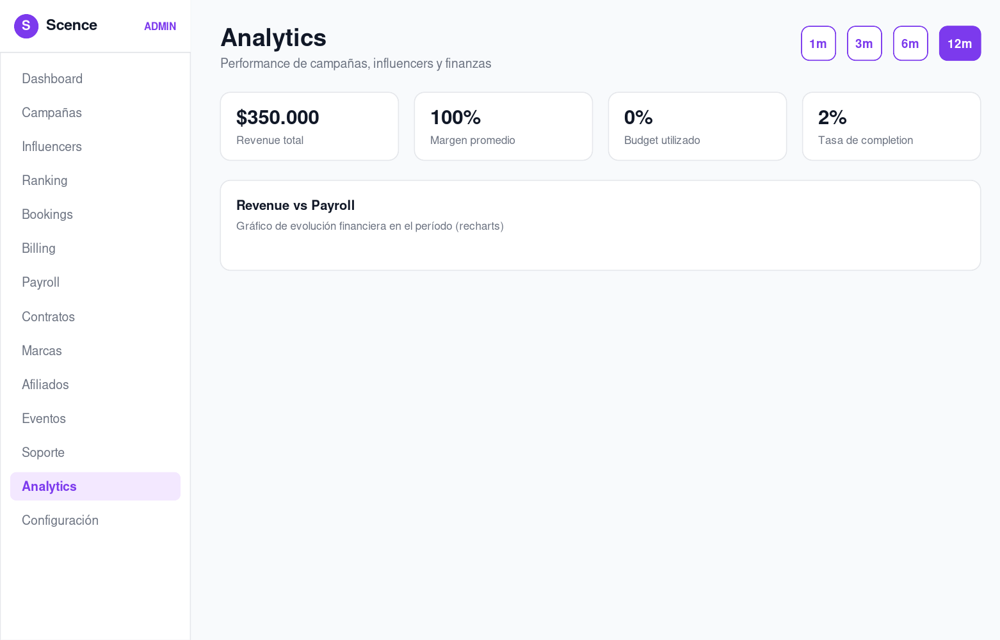

**Navegación:** `admin-analytics` · **Tablas:** `invoices`, `payroll_runs`, `campaigns`, `campaign_deliverables`

Vista financiera ejecutiva: revenue total, margen promedio, budget utilizado, tasa de completion, por periodo (1/3/6/12 meses).

#### AD-16 Soporte
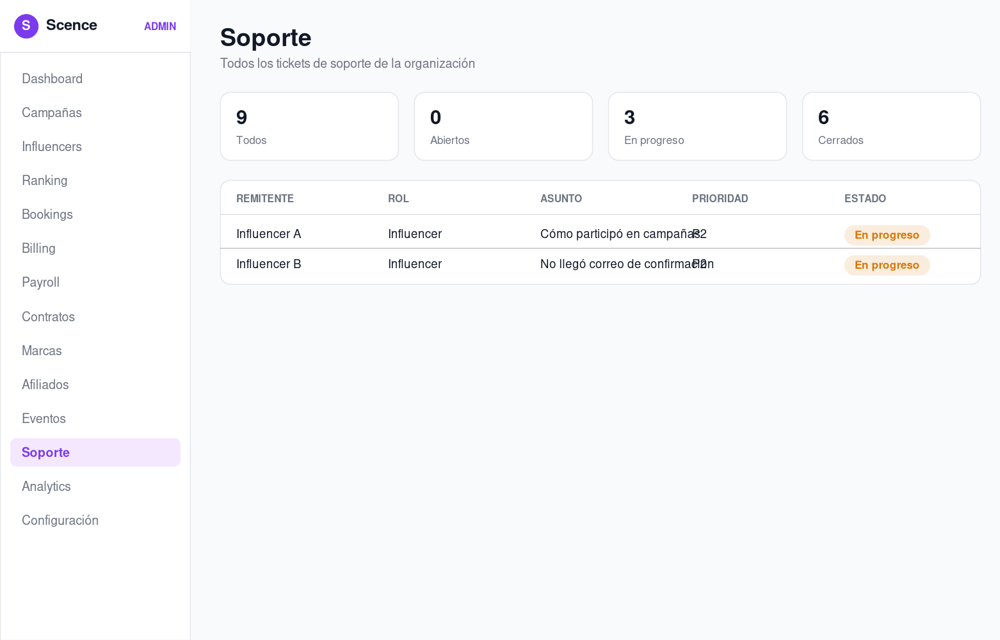

**Navegación:** `admin-support` (todos los tickets de la organización) · **Tabla:** `support_tickets`

Triage por prioridad (P1-P3), estado (Abierto/En progreso/Cerrado), remitente y rol.

#### AD-17 Configuración
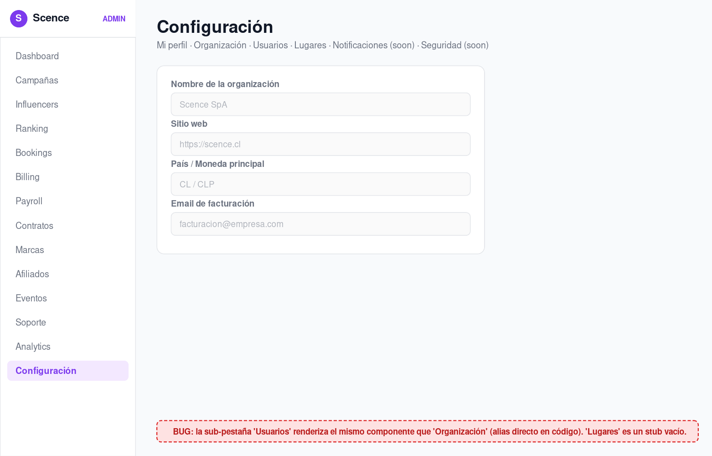

**Navegación:** `admin-settings/*` · **Tabla:** `organizations`

| Tab | Fuente | Estado |
|---|---|---|
| Mi perfil | `profiles.*` | ✅ OK |
| Organización | `organizations.*` | ✅ OK |
| Usuarios | — | 🔜 marcado "soon" en v2.1 (antes alias engañoso — bug B-02, ver Anexo A) |
| Lugares | `locations` | ✅ CRUD completo — ver G-13 |

---
### 3.2 Portal Marca

Acceso: `user_metadata.is_brand = true`. Rutas: `brand-*`. Cliente B2B — gestiona sus propias campañas y contrata influencers del catálogo SCENCE.

**Regla clave de producto:** el portal Marca reutiliza la experiencia Admin filtrada por permisos (no vistas paralelas reducidas). La Marca solo ve: sus campañas, influencers relacionados a sus campañas, marcas colaboradoras relacionadas (solo el nombre). La Marca NO ve: base completa de influencers SCENCE, notas internas, payroll interno, datos privados/direcciones, datos comerciales sensibles de otras marcas (BR-06).

#### MK-01 Dashboard
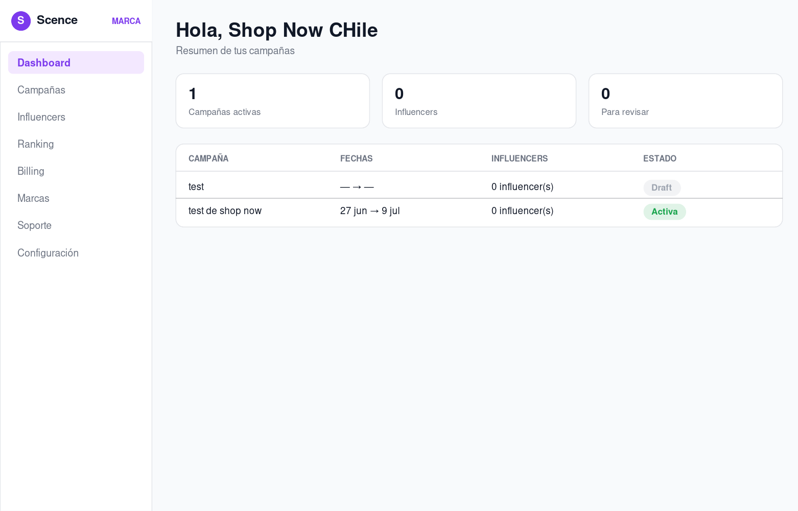

**Navegación:** `brand-dash` · **API:** `GET /api/brand/campaigns` · **Tablas:** `brands`, `campaigns`, `campaign_influencers`, `campaign_deliverables`

| Campo | Fuente | Para qué sirve |
|---|---|---|
| Campañas activas / Influencers / Para revisar | Agregados filtrados por `brand_id` | Vista rápida operativa |
| Lista "Tus campañas" | `campaigns where brand_id = brand.id` | Acceso directo a cada campaña propia |

**Regla:** solo ve campañas donde `campaigns.brand_id = brand.id` (BR-06).

#### MK-02 Lista de Campañas
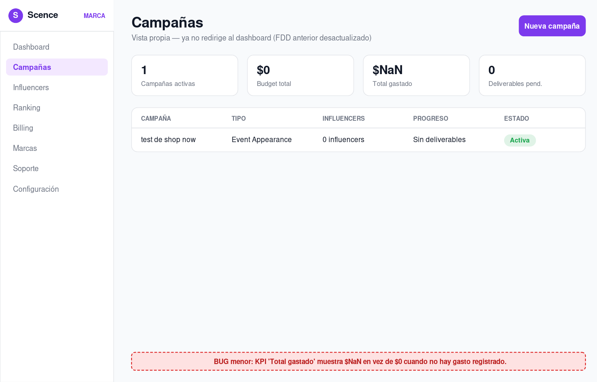

**Navegación:** `brand-campaigns` · **API:** `GET /api/brand/campaigns` — lista real con los mismos filtros que Admin (búsqueda, tipo, plataforma, fecha, estado), reutilizando `CampaignsClient.tsx`.

**Estado:** ✅ corregido en v2.1 — KPI "Total gastado" mostraba `$NaN` sin datos; ahora `$0` (fix aplicado, ver Anexo A).

#### MK-03 Nueva Campaña
Mismo wizard 4 pasos que AD-03 (`CampaignForm.tsx` compartido). **Regla:** `brand_id` y `created_by_brand_id` = brand.id del usuario logueado (BR-10).

#### MK-04 Detalle de Campaña
Mismo componente que AD-04 (`CampaignDetail`), reutilizado vía `brand-campaigns/[id]` — solo si `brand_id` = la propia. Acciones de edición solo si la marca es creadora. Datos de marcas colaboradoras (si las hubiera) se muestran solo por nombre.

#### MK-05 Invitar Influencer
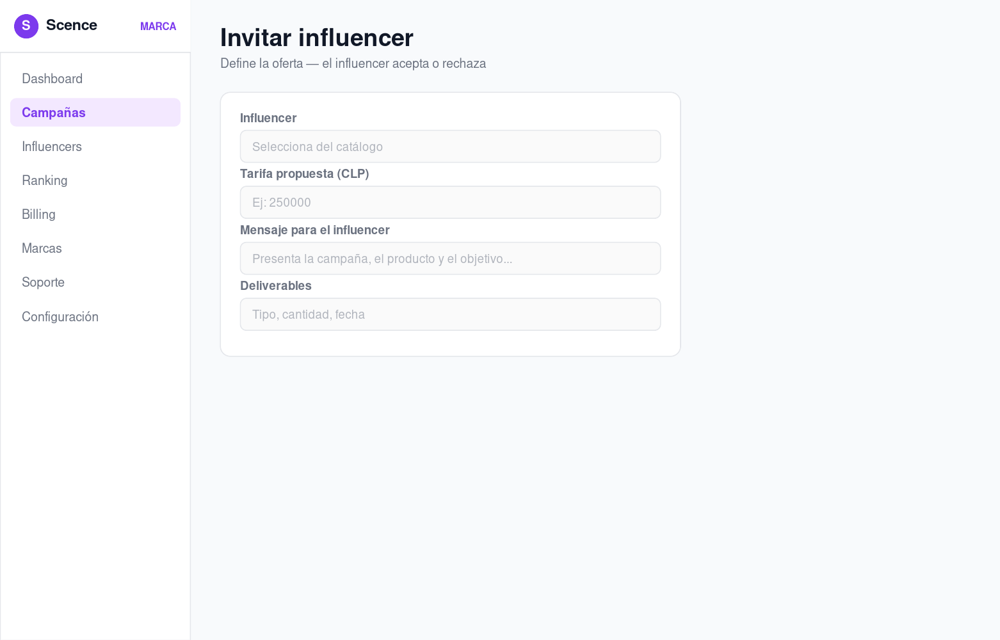

**Navegación:** `brand-campaigns/[id]/invite` · **API:** `POST /api/brand/campaigns/[id]/invite` · **Tabla:** `campaign_influencers`

| Campo | Fuente | Para qué sirve |
|---|---|---|
| Influencer seleccionado | Viene del catálogo (`?influencerId=`) | Define a quién se invita |
| Tarifa propuesta (CLP) | Input libre, opcional | Si vacío, se negocia directo |
| Mensaje | Input libre | Contexto/objetivo para el influencer |
| Deliverables (tipo, cantidad, fecha) | `deliverables_spec` (inmutable, BR-05) | Genera los `campaign_deliverables` reales al aceptar |

**Estado:** ✅ corregido en v2.1 — el submit apuntaba a un endpoint inexistente (`/api/brand-campaigns/...` en vez de `/api/brand/campaigns/...`), mismo root-cause que B-07. Ver Anexo A.

#### MK-06 Postulaciones / Invitaciones
**Navegación:** `brand-campaigns/[id]/applications` · **API:** `GET/PATCH /api/brand/campaigns/[id]/applications`

Lista de postulaciones (campañas open) e invitaciones enviadas, con acciones Aceptar/Rechazar.

**Estado:** ✅ corregido en v2.1 — bug B-07, mismo root-cause que MK-05 (URL de fetch no coincidía con la ruta real de la API). Ver Anexo A.

#### MK-07 Catálogo de Influencers
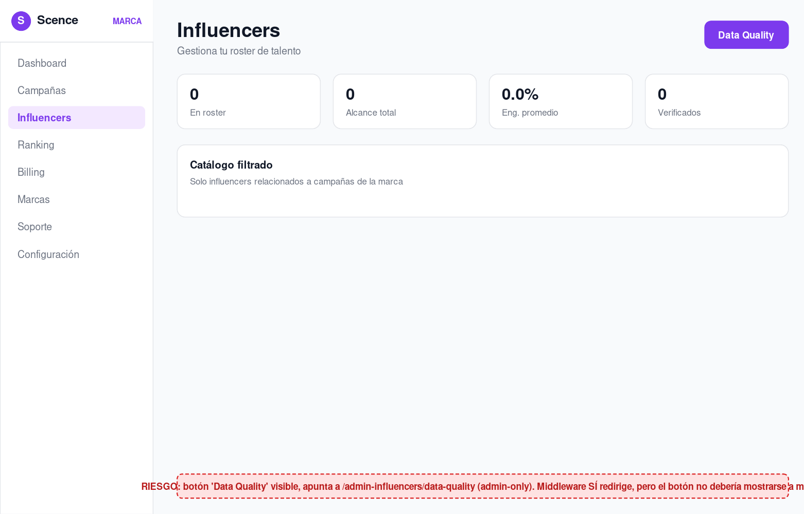

**Navegación:** `brand-influencers` — catálogo filtrado a los influencers relacionados con sus campañas (no el roster completo de 1.450, por BR-06).

| Campo | Visible para Marca |
|---|---|
| Nombre / avatar / plataformas / seguidores / engagement / rating | ✅ |
| Email / teléfono / tarifas históricas con otras marcas | ❌ (BR-06) |
| Botón "Data Quality" | ❌ (ocultado en v2.1 — bug B-08, ver Anexo A) |
| Nombre del influencer clickable a ficha admin | ❌ (ocultado en v2.1 — bug B-01, no hay ficha propia de marca aún — gap G-09) |

#### MK-08 Ranking de Influencers
**Navegación:** `brand-influencers/ranking` — solo relacionados a sus campañas.

#### MK-09 Perfil de Marca
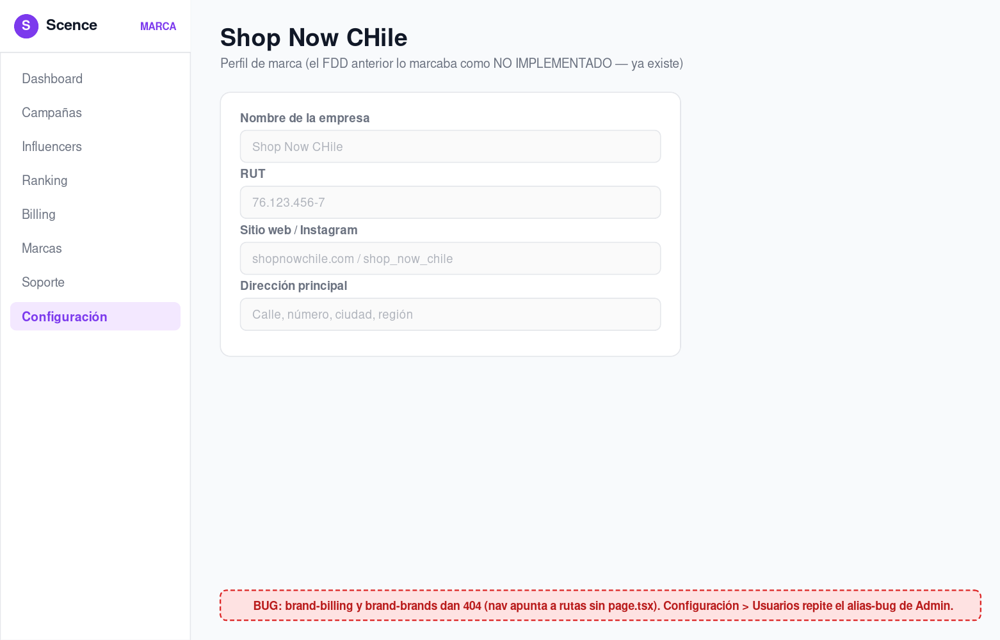

**Navegación:** `brand-profile` · **Tabla:** `brands`

| Campo | Fuente | Para qué sirve |
|---|---|---|
| Nombre empresa / RUT / Industria | `brands.name, tax_id, industry` | Ficha comercial editable por la propia marca |
| Sitio web / Instagram | `brands.website, instagram_handle` | Presencia digital |
| Dirección principal | `brands.address_*` | Facturación/logística — privado, no visible a otras marcas |

#### MK-10 Configuración
**Navegación:** `brand-settings/*` — mismo patrón que Admin (Mi perfil, Organización, Usuarios 🔜, Lugares).

#### MK-11 Soporte
**Navegación:** `brand-support` — solo tickets propios.

#### MK-12 Billing (Marca) — Planes de suscripción
**Navegación:** `brand-billing` · **API:** `GET /api/brand/billing`, `POST /api/stripe/checkout`, `POST /api/stripe/portal` · **Tablas:** `subscription_plans`, `subscriptions`

Construido 2026-07-01 (antes marcado "soon"; antes de eso, 404 real — bug B-04). 3 planes estilo "Montu": Starter ($59.990 CLP/mes), Plus ($119.990 CLP/mes), Enterprise (desde $249.990 CLP/mes + IVA, sin checkout — "Hablar con ventas").

| Campo | Fuente | Para qué sirve |
|---|---|---|
| Cards de planes (nombre, precio, features, límites) | `subscription_plans` (activos) | Comparación de planes |
| Plan actual + estado + próxima renovación | `subscriptions` join `subscription_plans` | Estado de la suscripción de la marca |
| Contratar (Starter/Plus) | `POST /api/stripe/checkout` → Stripe Checkout | Alta de suscripción |
| Gestionar suscripción | `POST /api/stripe/portal` → Stripe Customer Portal | Cambiar método de pago, cancelar |

**Estado real de la pasarela de pago:** el código está completo y es plan-aware (`checkout`/`webhook`/`portal` leen `subscription_plans.stripe_price_id_monthly`), pero el cobro real no funciona hasta que Pri: (1) cree 2 Stripe Prices recurrentes reales (Starter/Plus) y pegue sus IDs en `subscription_plans.stripe_price_id_monthly`, (2) agregue `STRIPE_SECRET_KEY`/`STRIPE_WEBHOOK_SECRET` a Vercel, (3) registre el endpoint de webhook en su dashboard de Stripe. Mientras tanto, "Contratar" devuelve un error controlado (422) en vez de fallar en silencio.

#### MK-13 Marcas colaboradoras — 🔜 pendiente
**Navegación:** `brand-brands` — marcado "soon" en v2.1 (antes 404 real — bug B-05). Requiere decisión de producto: alcance de "solo nombre" de otras marcas por campaña compartida (BR-06).

---

### 3.3 Portal Influencer

Acceso: `user_metadata.is_influencer = true`. Rutas: `inf-*`. Creador de contenido — ve invitaciones/campañas, sube contenido, ve historial de pagos.

#### IN-01 Dashboard
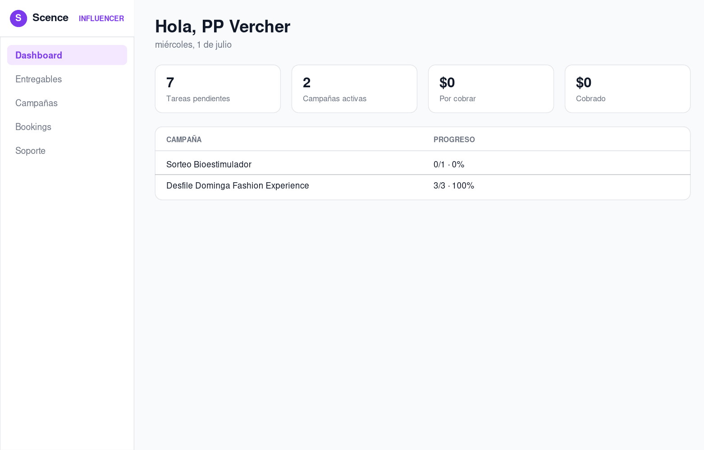

**Navegación:** `inf-dash` · **API:** `GET /api/influencer/campaigns`, `GET /api/influencer/tasks` · **Tablas:** `campaign_influencers`, `campaign_deliverables`, `bookings`

| Campo | Fuente | Para qué sirve |
|---|---|---|
| Tareas pendientes / Campañas activas | Agregados sobre `campaign_deliverables`, `campaign_influencers` | Carga de trabajo |
| Por cobrar / Cobrado | `payroll_runs` filtrado por influencer | Transparencia de pagos |
| Avance de campañas | `deliverables aprobados / total` | Seguimiento de cumplimiento |

#### IN-02 Entregables (Mis Tareas)
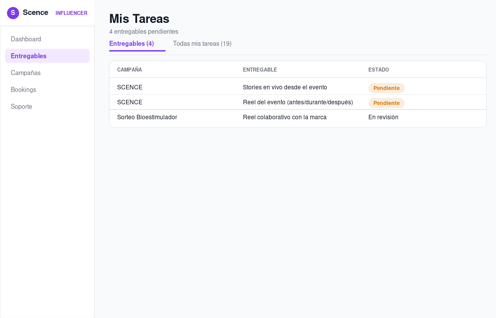

**Navegación:** `inf-tasks` · **API:** `GET /api/influencer/tasks`, `PATCH /api/influencer/tasks/[id]`, `POST /api/influencer/deliverables/[id]/submit` · **Tabla:** `influencer_tasks` (no `campaign_deliverables` directamente — corregido en v2.1, error de documentación previo)

`influencer_tasks` es una tabla genérica de checklist personal (`source_type: campaign | booking | event | manual`, `status: pending | in_progress | done | skipped`), con un campo `deliverable_id` que la vincula 1:1 a un `campaign_deliverables` real cuando la tarea viene de una campaña (BR-04). También se usa para tareas sin deliverable (confirmar asistencia a bookings/eventos vía `createInfluencerTasks()` en `lib/influencer-tasks.ts`) — eso sí es correcto y no se tocó.

| Campo | Fuente | Para qué sirve |
|---|---|---|
| Campaña / tipo de entregable | `campaign_deliverables.campaign_id, type` | Contexto de la entrega |
| Estado (Pendiente/En revisión/Aprobado/Rechazado) | `campaign_deliverables.status` | Ciclo de vida (ver §5) |
| Subir | Form de URL + notas | Único punto de entrega de contenido |

**Regla:** el influencer solo ve sus propios deliverables (`WHERE influencer_id = auth.uid()`).

**Estado:** ✅ corregido en v2.1 — link a detalle de campaña apuntaba a ruta legacy (bug B-09, ver Anexo A).

#### IN-03 Campañas
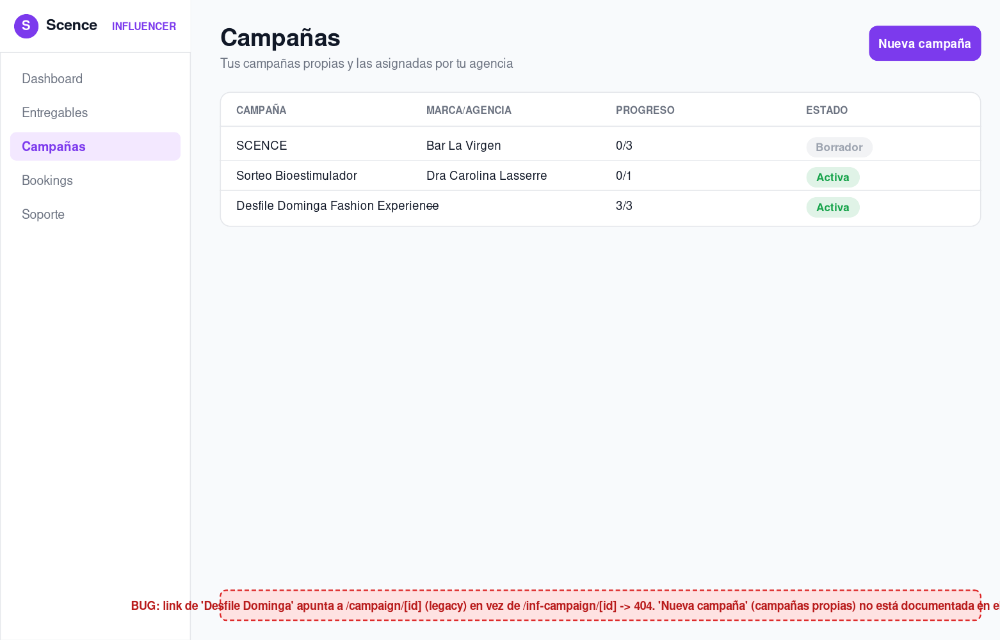

**Navegación:** `inf-campaigns` · **API:** `GET /api/influencer/campaigns`, `GET /api/influencer/my-campaigns`

| Campo | Fuente | Para qué sirve |
|---|---|---|
| Asignadas por agencia | `campaign_influencers` donde `application_status=accepted` | Campañas reales de SCENCE/marca |
| "Campañas propias" (botón Nueva campaña) | Tabla propia, sin marca asociada | Posible tracking personal — **G-11, requiere decisión de producto** |

**Estado:** ✅ corregido en v2.1 — 2 links a detalle apuntaban a ruta legacy (bug B-09, ver Anexo A).

#### IN-04 Detalle de Campaña
**Navegación:** `inf-campaign/[id]` — reutiliza `CampaignDetailView.tsx` (mismo componente base, no el `CampaignDetail` de Admin).

#### IN-05 Bookings
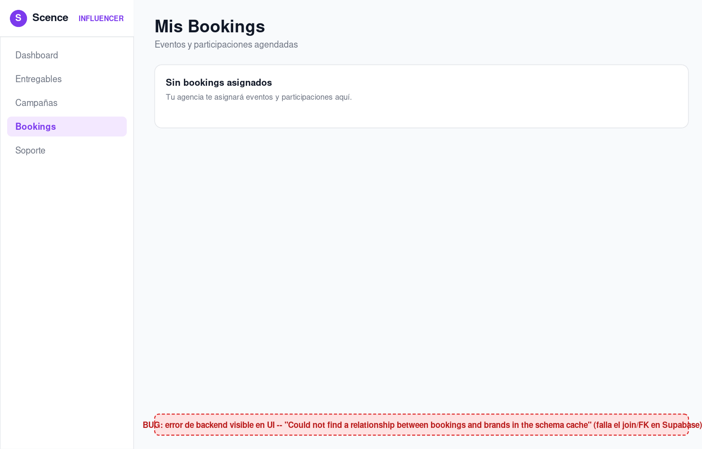

**Navegación:** `inf-bookings` · **Tabla:** `bookings`

**Estado:** ✅ corregido en v2.1 — bug B-06. La query pedía un join directo `bookings → brands` que no existe en el schema real (`bookings` no tiene FK a `brands`); la relación correcta es `bookings.campaign_id → campaigns.brand_id → brands.id`. Corregido anidando `brand` dentro de `campaign` en el select y aplanándolo de vuelta en la respuesta. Ver Anexo A.

#### IN-06 Perfil
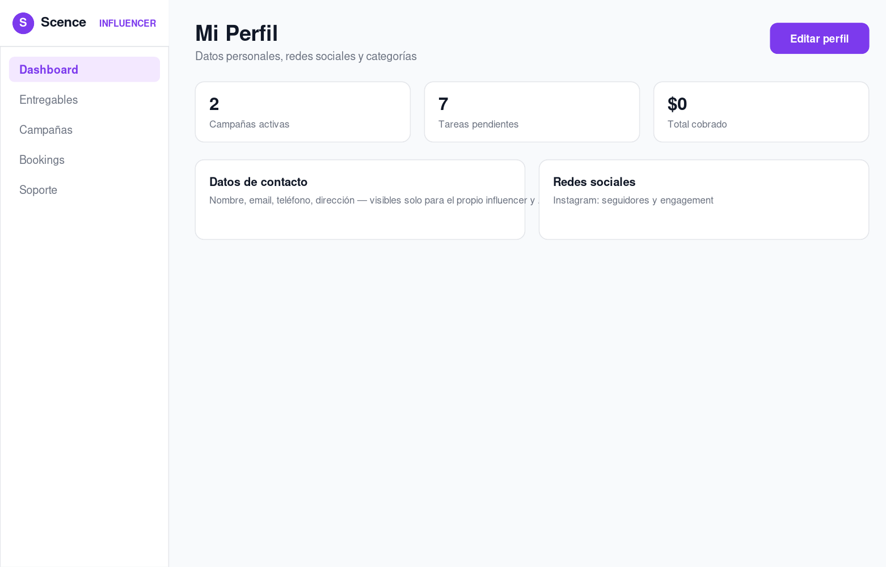

**Navegación:** `inf-profile` · **Tabla:** `influencers`

| Campo | Fuente | Para qué sirve |
|---|---|---|
| Nombre, email, teléfono, dirección | `influencers.*` | Contacto — solo visible para el propio influencer y Admin (BR-06) |
| Categorías (tags) | `influencers.categories` | Filtros del catálogo de marca |
| Redes sociales | `influencer_social_profiles` | Base del ranking y tarifas sugeridas |

#### IN-07 Soporte
**Navegación:** `inf-support` — solo tickets propios.

---
## 4. Reportes

Los siguientes reportes/vistas agregadas existen hoy en producción. A diferencia de un reporting engine dedicado, en SCENCE cada uno vive embebido en su módulo (no hay un "Report Manager" separado).

### REP-01 Reporte PDF de Campaña

| | |
|---|---|
| **Propósito** | Resumen ejecutivo exportable de una campaña: elenco, deliverables, budget, timeline. |
| **Frecuencia de uso** | Bajo demanda, al cierre o para presentar a stakeholders. |
| **Navegación** | `admin-campaigns/[id]/report` (Admin) · `brand-campaigns/[id]/report` (Marca) |
| **Campos** | Nombre de campaña, marca, fechas, budget total/gastado, influencers participantes, deliverables por estado. |

### REP-02 Analytics Ejecutivo

| | |
|---|---|
| **Propósito** | Vista financiera de alto nivel: revenue, margen, budget utilizado, tasa de completion. |
| **Frecuencia de uso** | Mensual/trimestral. |
| **Navegación** | `admin-analytics` |
| **Campos** | Revenue total, margen promedio, % budget utilizado, tasa de completion, serie Revenue vs. Payroll por periodo (1/3/6/12 meses). |

### REP-03 Ranking de Influencers

| | |
|---|---|
| **Propósito** | Ordenar el roster (o el catálogo filtrado de una marca) por desempeño real, no solo por métricas de redes. |
| **Frecuencia de uso** | Continuo, al elegir influencers para una nueva campaña. |
| **Navegación** | `admin-influencers/ranking` · `brand-influencers/ranking` |
| **Campos** | Seguidores, engagement, rating, campañas realizadas, entregables, % de cumplimiento. |

### REP-04 Data Quality del Roster

| | |
|---|---|
| **Propósito** | Detectar duplicados e inconsistencias antes de escalar la base de influencers. |
| **Frecuencia de uso** | Mensual o antes de una importación masiva. |
| **Navegación** | `admin-influencers/data-quality` |
| **Campos** | Total influencers, activos/inactivos, sin Instagram, duplicados por email/URL/@ de Instagram. |

### REP-05 Billing (Facturas + Payroll)

| | |
|---|---|
| **Propósito** | Salud de cobranza (facturas a marcas) y costo total de payroll a influencers. |
| **Frecuencia de uso** | Continuo/semanal. |
| **Navegación** | `admin-billing` |
| **Campos** | Total facturado, cobrado, vencido; total payroll; detalle por factura (cliente, campaña, monto, IVA, estado). |

---

## 5. Convenciones de Estado y Color (Theming)

SCENCE no usa temas visuales sobre planos (no aplica, a diferencia de un sistema de gestión de espacios físicos) — el equivalente funcional es la convención de color/badge por estado de cada entidad, consistente en toda la UI:

| Entidad | Estado | Color/Badge |
|---|---|---|
| Campaña | `active` | Verde |
| Campaña | `draft` | Gris |
| Campaña | `completed` | Violeta |
| Campaña | `canceled` | Rojo |
| Campaña | `paused` | Ámbar |
| Postulación/Invitación | `pending` | Ámbar |
| Postulación/Invitación | `accepted` | Verde |
| Postulación/Invitación | `rejected` | Rojo |
| Postulación/Invitación | `expired` / `withdrawn` | Gris |
| Deliverable | `pending` | Gris |
| Deliverable | `in_review` | Ámbar |
| Deliverable | `approved` / `published` | Verde |
| Deliverable | `rejected` | Rojo |
| Factura | `paid` | Verde |
| Factura | `overdue` | Rojo |
| Factura | `sent` | Ámbar |
| Factura | `draft`/`void` | Gris |

---

## 6. Requisitos de Integración

| ID | Integración | Descripción | Dirección |
|---|---|---|---|
| INT-01 | Google Calendar (Service Account) | Sincroniza `bookings` con eventos de calendario para la agenda operativa de Admin. | Entrada/Salida |
| INT-02 | Apify (Instagram Sync) | Actualiza followers/engagement de `influencer_social_profiles` bajo demanda desde Data Quality. | Entrada |
| INT-03 | Resend | Envío de emails transaccionales (ver §9). | Salida |
| INT-04 | Stripe | Checkout/Webhook/Portal plan-aware, conectados a `subscription_plans`/`subscriptions` y a la UI real (`brand-billing`, MK-12). Cobro real pendiente de Price IDs y API keys de producción (ver MK-12). | Entrada/Salida |
| INT-05 | Supabase Auth | Autenticación y sesión; `user_metadata` determina el portal (`is_brand`, `is_influencer`). | Entrada/Salida |

---

## 7. Datos e Importación Masiva

A diferencia de un proyecto de migración de sistema legacy, SCENCE no migra datos de un sistema anterior — pero sí tiene un flujo real de carga masiva de datos que documentar:

**Nombre:** Importación masiva de influencers (CU-04)
**Resumen:** Carga de influencers al roster vía archivo CSV.
**Navegación:** `admin-influencers` → Bulk Upload
**API:** `POST /api/influencers/bulk`
**Volumen:** hasta 1.500 influencers por lote.
**Reglas de negocio:** los registros se crean con `status=draft`; requiere revisión posterior en Data Quality (REP-04) antes de activarse en el roster operativo.

**Nombre:** Importación de ocupación/asignación (equivalente al patrón "Occupancy List Import" de proyectos de gestión de espacio)
**Estado:** no implementado en SCENCE — no aplica, el modelo de asignación es por invitación/postulación (BR-03), no por importación batch.

---

## 8. Requisitos No-Funcionales

### NFR-01 Auditoría / Trazabilidad
El detalle de campaña incluye un tab "Historial" con audit log de cambios de estado (ver AD-04). **No confirmado en esta auditoría:** si existe una tabla de audit trail genérica a nivel de plataforma (cambios en `influencers`, `brands`, etc.) — queda como pendiente de verificación, no como hallazgo negativo.

### NFR-02 Infraestructura
Hosting en Vercel (frontend/API routes) + Supabase Cloud (Postgres, Auth, Storage). Sin infraestructura propia que mantener.

### NFR-03 Rendimiento
No hay SLA de performance formalizado ni monitoreo de latencia documentado en esta auditoría.

### NFR-04 Backup y Recuperación
Backups gestionados por Supabase (point-in-time recovery según plan contratado). No verificado el plan/retención exacta en esta auditoría.

### NFR-05 Seguridad multi-portal
El middleware (`src/middleware.ts`) es la capa de control de acceso entre los 3 portales (BR-02, BR-11). Confirmado por auditoría que bloquea correctamente accesos cruzados incluso cuando la UI expone un botón indebido (bug B-08).

### NFR-06 Licenciamiento
Stack basado en servicios de suscripción: Vercel, Supabase, Apify, Resend, Anthropic (AI Campaign Builder). Sin licencias perpetuas que gestionar.

### NFR-07 Otro
N/A.

---

## 9. Notificaciones por Email

Sistema de emails transaccionales vía Resend (`src/lib/resend.ts`). Plantillas confirmadas en el código:

**EMAIL-01 — Invitación a campaña** (`influencerInviteEmail`)
Asunto implícito: invitación de marca a campaña. Incluye nombre del influencer, marca, campaña, mensaje opcional y link a la invitación.
**Estado:** ✅ **Corregido 2026-07-01 (gap G-08):** ahora se invoca desde `POST /api/brand/campaigns/[id]/invite` justo después de crear la invitación (`campaign_influencers`). No bloqueante — si el influencer no tiene email o el envío falla, la invitación queda creada igual.

**EMAIL-02 — Confirmación de booking** (`bookingConfirmEmail` en `resend.ts`)
**Estado:** ✅ **Corregido 2026-07-01 (gaps G-08 y G-14):** se confirmó que no era una duplicación real sino dos pasos de un mismo flujo: `bookingConfirmationEmail` (inline, en `send-confirmations/route.ts`) pide al influencer que confirme/decline vía botones; `bookingConfirmEmail` (`resend.ts`) ahora se invoca como recibo de confirmación en `GET /api/bookings/confirm` cuando el influencer hace clic en "confirmar". Flujo completo: Admin dispara `send-confirmations` desde `BookingsClient.tsx` → influencer confirma → recibe recibo.

**EMAIL-03 — Estado de deliverable** (`deliverableStatusEmail`)
**Estado:** ✅ activa, invocada desde `src/app/api/emails/deliverable-status/route.ts`. Notifica al influencer cuando su entrega es aprobada o rechazada, con notas de revisión si aplica.

**EMAIL-04 — Factura** (`invoiceEmail`)
**Estado:** ✅ activa, invocada desde `src/app/api/invoices/[id]/route.ts`. Notifica a la marca el detalle de una factura (cliente, total, vencimiento).

**EMAIL-05 — Campaña abierta disponible** (`campaignOpenAvailableEmail`)
**Estado:** ✅ activa 2026-07-01, invocada desde `POST /api/campaigns/[id]/notify-influencers` (botón manual admin, ver AD-04). No automática — dispara solo cuando el Admin aprieta "Notificar siguiente batch" en una campaña `visibility=open`.

---

## 10. Documentos de Apoyo

| Documento | Descripción | Ubicación |
|---|---|---|
| Este FDD (fuente) | Versión Markdown, control de versiones | `docs/FUNCTIONAL_DESIGN.md` (repo) |
| Este FDD (Word) | Copia editable/imprimible | Carpeta del proyecto |
| Mockups de pantallas | 29 SVG reconstruidos de la auditoría en vivo | `docs/mockups/*.svg` |
| Migraciones de base de datos | Definición real de tablas (con drift conocido — ver nota) | `supabase/migrations/*.sql` |
| Middleware de rutas | Enforcement de roles por portal | `src/middleware.ts` |

**Nota de integridad:** durante esta auditoría se confirmó que las migraciones en el repo **no reflejan el 100% del schema real** de producción (ej. la tabla `brands` no tiene migración de creación en el repo, pero existe y está en uso — fue creada fuera del flujo de migraciones versionadas). Se recomienda una tarea futura de reconciliación schema-real vs. migraciones. **Actualización 2026-07-01:** se encontró y documentó el mismo patrón en `influencers.commune` (usada en código desde antes, sin migración versionada) — migración `20260701000003_document_commune_column.sql` agregada, aditiva, sin cambio de datos.

---

## 11. Glosario

| Término | Definición |
|---|---|
| BR | Business Rule — regla de negocio (§2) |
| RLS | Row Level Security — políticas de acceso a nivel de fila en Postgres/Supabase |
| Deliverable | Entregable de contenido asociado a una campaña e influencer |
| Booking | Reserva/evento agendado con un influencer (aparición, shoot, evento) |
| Payroll run | Corrida de pago agrupada a uno o más influencers |
| CLP | Peso chileno — moneda base de la plataforma |
| IVA | Impuesto al Valor Agregado (19% en Chile) — BR-08 |
| `is_brand` / `is_influencer` | Flags en `user_metadata` de Supabase Auth que determinan el portal del usuario |
| `organization_id` | Identificador de tenant — todo dato queda scoped a una organización (BR-01) |
| `application_status` | Estado del ciclo invitación/postulación (`pending`, `accepted`, `rejected`, etc.) |
| Campaña `private` vs `open` | Visibilidad de campaña: por invitación directa vs. postulación abierta (BR-03) |
| Portal | Uno de los 3 frontends de la app: Admin, Marca, Influencer |

---
## 12. Anexo A — Bugs encontrados y su estado

Se encontraron 9 bugs de producción en la auditoría en vivo del 2026-07-01. **6 fueron corregidos** con commits pequeños e independientes (sin push a producción, pendiente de aprobación de deploy). 4 quedaron marcados "🔜 soon" en vez de construir la feature completa, por requerir decisión de producto sobre qué datos mostrar (relacionado a BR-06).

| ID | Severidad | Portal | Descripción | Estado v2.1 |
|---|---|---|---|---|
| B-01 | 🔴 Crítica | Admin/Marca | Clic en influencer del roster → 404 (`/influencers/[id]` no existe) | ✅ Corregido — link real a `/admin-influencers/[id]`; en Marca, no clickable (sin ficha propia aún) |
| B-02 | 🟡 Media | Admin | Configuración → Usuarios mostraba el formulario de Organización (alias engañoso) | ✅ Mitigado — tab marcado "soon", ya no navegable. Construir gestión real de usuarios queda pendiente de decisión de producto |
| B-03 | 🟡 Media | Marca | Mismo bug que B-02 | ✅ Mitigado — mismo tratamiento |
| B-04 | 🔴 Alta | Marca | `brand-billing` → 404 | ✅ Mitigado — nav marcado "soon" en vez de 404. Construir la vista real queda pendiente de decisión de producto (qué facturas mostrar) |
| B-05 | 🔴 Alta | Marca | `brand-brands` → 404 | ✅ Mitigado — mismo tratamiento. Requiere definir alcance de "solo nombre" de marcas colaboradoras (BR-06) |
| B-06 | 🟡 Media | Influencer | Error crudo de Supabase: *"Could not find a relationship between 'bookings' and 'brands'"* | ✅ Corregido — join reescrito vía `bookings.campaign_id → campaigns.brand_id → brands.id` |
| B-07 | 🟡 Media | Marca | Tab de postulaciones/invitaciones: `Unexpected token '<' ... is not valid JSON` | ✅ Corregido — el fetch apuntaba a `/api/brand-campaigns/...` en vez de `/api/brand/campaigns/...`. Se encontró y corrigió el mismo bug en el submit de "Invitar influencer" (no reportado antes) |
| B-08 | 🟢 Baja | Marca | Botón "Data Quality" visible, apunta a herramienta admin-only | ✅ Corregido — oculto para Marca |
| B-09 | 🔴 Alta | Influencer | Clic en campaña asignada → 404 (`/campaign/[id]` legacy) | ✅ Corregido — 4 ocurrencias actualizadas a `/inf-campaign/[id]` |
| B-10 | 🟡 Media | Influencer | "Tareas pendientes" (`inf-dash`, `inf-tasks`) mostraba tareas fantasma sin relación a ningún deliverable real, mezcladas con las reales | ✅ Corregido — reportado por Pri revisando el FDD (BR-04). `POST /api/campaigns/[id]/influencers` creaba 4 `influencer_tasks` genéricas hardcodeadas (`createInfluencerTasks`) además de las sincronizadas 1:1 con `campaign_deliverables` (`syncDeliverableTask`). Se quitó la llamada genérica en ese flujo (no se tocó su uso legítimo en bookings/eventos) y se borraron 412 filas fantasma ya existentes en producción (348 sin interacción + 64 marcadas "done") |
| — | 🟢 Muy baja | Marca | KPI "Total gastado" mostraba `$NaN` sin datos | ✅ Corregido — guard `?? 0` agregado |
| B-11 | 🟡 Media | Influencer | Al aprobar una postulación a campaña open (`PATCH /api/brand/campaigns/[id]/applications`, `action=accept`), se creaban los `campaign_deliverables` reales pero nunca se llamaba a `syncDeliverableTask` — el influencer no veía la tarea en "Mis tareas" pese a tener un deliverable real asignado. Es el gap inverso a B-10 (faltaban tareas reales, no sobraban fantasma). Tampoco se enviaba ningún email al aprobar | ✅ Corregido — encontrado en auditoría del flujo open/postulación pedida por Pri (2026-07-01). Se agregó el `syncDeliverableTask` por cada deliverable creado y un email de aprobación (`campaignApplicationApprovedEmail`, plantilla nueva en `resend.ts`, no reutiliza `deliverableStatusEmail` porque ese es para estado de contenido ya enviado, no para aprobación de participación) |
| B-12 | 🔴 Alta | Admin | Editar una campaña privada existente no permitía cambiar visibilidad a Pública/Open — el campo no existía en el form de edición | ✅ Corregido — `CampaignEditForm.tsx` no tenía `visibility` en schema/reset/submit, a diferencia de `CampaignForm.tsx` (creación). El backend (`PATCH /api/campaigns/[id]`) ya aceptaba el campo sin cambios; el bug era 100% frontend. Reportado urgente por Pri |
| B-13 | 🔴 Crítica | Influencer | Sección "Campañas Disponibles" (campañas open) nunca mostraba nada, para ninguna influencer, en toda la organización | ✅ Corregido — `GET /api/influencer/campaigns/open` filtraba `status IN ('draft','pending_influencers','active')`; `pending_influencers` **no existe** en el enum real `campaign_status` (`draft, pending_approval, active, paused, completed, canceled`). Postgres rechazaba la query completa (400) y el frontend (`inf-dash/page.tsx`) silenciaba el error como lista vacía. Mismo typo corregido en `apply/route.ts` y `brand/campaigns/[id]/applications/route.ts` (ahí no rompían nada, eran comparaciones JS muertas, pero igual incorrectas) |
| B-14 | 🔴 Crítica | Admin | El panel "solicitudes pendientes" del tab Influencers en `CampaignDetail.tsx` (admin) nunca mostraba postulaciones reales, y su botón "Aceptar" no enviaba el email de aprobación (B-11 solo cubría el endpoint de Marca) | ✅ Corregido — el panel filtraba por `ci.status === 'applied'`, un valor que el flujo real de postulación (`/api/influencer/campaigns/[id]/apply`) nunca setea (solo setea `application_status='pending'`). Se creó `src/lib/campaign-applications.ts` (`acceptCampaignApplication`) como lógica única compartida entre Marca y Admin — antes eran 2 implementaciones desincronizadas. Nuevo endpoint `PATCH /api/campaigns/[id]/applications` (admin). Cierra G-07 |
| — | 🟢 Baja | Admin | Dropdown "Marca" en crear/editar campaña sin filtro (~30 marcas en una sola lista) ni forma de crear una marca nueva sin salir del form | ✅ Corregido — nuevo componente `BrandSelector.tsx` (combobox con búsqueda + "Crear marca X" inline), reemplaza el `<select>` plano duplicado en ambos forms. Reutiliza `GET/POST /api/brands` existente, sin cambios de backend |
| — | 🟢 Baja | Influencer | No existía forma de ver el detalle de una campaña open (deliverables, presupuesto, brief) antes de postular — solo un botón "Aplicar" directo | ✅ Agregado — nuevo `GET /api/influencer/campaigns/[id]` (preview, mismo criterio de visibilidad que `/open` y `/apply`) + rama de solo-lectura en `CampaignDetailView.influencer.tsx` (reutiliza `/inf-campaign/[id]` existente en vez de crear una ruta nueva) |
| — | 🟢 Baja | Admin | En las tablas de Influencers, Campañas y Marcas: la selección de columnas visibles y el orden no persistían (se perdían al recargar o navegar), y no todas las columnas eran ordenables por header | ✅ Corregido (parcial) — nuevo hook `useLocalStorageState` + componente compartido `SortableTH`. Influencers y Campañas quedaron con columnas+sort 100% persistentes. Marcas (`admin-brands`) solo quedó con el sort-preset y la vista (list/grid) persistentes — esa tabla no tenía toggle de columnas ni sort por header antes (usa un `<select>` con presets fijos); construir eso es una ampliación mayor, pendiente de confirmar prioridad |
| — | 🟢 Feature | Marca | Planes de suscripción y cobro no existían en UI (2 sistemas de billing desconectados en el código, ver changelog "2.1 (billing)") | ✅ Construido — `subscription_plans` reestructurado a 3 tiers estilo Montu, `GET /api/brand/billing`, checkout/webhook/portal de Stripe unificados y plan-aware, página `brand-billing` real. Cierra MK-12. Cobro real pendiente de Price IDs/API keys (ver MK-12) |
| — | 🟢 Feature | Admin | Agregar influencers a una campaña privada usaba una tabla ad-hoc sin filtros reales (solo búsqueda libre), en vez de reutilizar el ranking existente | ✅ Construido — `InfluencerRanking` ganó una prop opcional `renderAction` (columna de acción por fila); `AddInfluencerClient.tsx` la reutiliza en modo selección, heredando sort por comuna/campañas colaboradas/entregables/rating y filtros de plataforma/última conexión. Ranking admin general sin cambios de comportamiento (prop opcional) |
| B-16 | 🔴 Alta | Admin | El botón toggle de "Visibilidad" en `CampaignDetail.tsx` escribía `visibility='public'`/`'invite_only'` al hacer `PATCH /api/campaigns/[id]`, pero `visibility` es texto libre (sin enum en BD) y el resto del sistema — incluido `GET /api/influencer/campaigns/open`, que filtra estrictamente `.eq('visibility','open')` — usa `'open'`/`'private'` | ✅ Corregido — 0 campañas afectadas en producción (nunca se había usado este botón para pasar a "pública"; las 2 campañas `open` reales se crearon así desde el wizard, que sí usa los valores correctos), pero de usarse habría desactivado la campaña para influencers sin ningún error visible en la UI. Encontrado auditando el mismo archivo para el botón de notificar influencers (ver AD-04, MK-XX) |
| — | 🟢 Feature | Admin | Parking lot: emailear a las mejores influencers cuando se publica una campaña pública | ✅ Construido 2026-07-01 (alcance simplificado por Pri: botón manual, no automático) — ver AD-04, EMAIL-05. Nueva tabla `campaign_influencer_notifications` para tracking de batches |
| B-15 | 🔴 Alta (seguridad) | Marca | `GET /api/brand/influencers/[id]` (usado al cargar el influencer preseleccionado en `brand-campaigns/[id]/invite`) validaba solo `organization_id`, no la relación real con la marca — a diferencia de `/api/brand/influencers` y `/api/brand/influencers/ranking`, que sí cruzan por campañas propias/colaboradora/`brand_influencers`. Permitía a cualquier marca pedir por ID el perfil completo (bio, redes, rate cards) de cualquier influencer del roster de la organización, sin relación a sus campañas — contradice BR-06 | ✅ Corregido — se unificó con el mismo cruce (campañas propias + colaboradora + `brand_influencers`) que ya usan los otros 2 endpoints; IDs fuera de ese conjunto devuelven 404 genérico (no confirma existencia). De paso ahora también resuelve usuarios invitados (`metadata.brand_id`), antes solo owner (`user_id`). Encontrado en auditoría de `brand-campaigns/[id]/invite` pedida por Pri, reportado y corregido con su aprobación explícita |
| — | 🔴 Crítica | Influencer | `CampaignRow` declaraba `campaign_deliverables` anidado dentro de `campaign`, pero `/api/influencer/my-campaigns` siempre lo devuelve como sibling — cualquier influencer real (no de prueba) que abriera el detalle de una campaña asignada (`/inf-campaign/[id]`) veía "Application error" (crash de cliente) | ✅ Corregido (`CampaignDetailView.influencer.tsx`) — se movió el campo al nivel correcto del tipo. Sin cambios de backend; `inf-dash/page.tsx` ya consumía el mismo endpoint bien. Encontrado por Pri en la UAT real del fix B-11 (aceptó una postulación real y el crash apareció al ver esa campaña) |
| — | 🟡 Media | Todos | Resend no lanza excepción en errores de API (key inválida, dominio no verificado) — resuelve `{data, error}` sin tirar. 7 de 12 call-sites de email solo tenían try/catch (nunca se disparaba) sin revisar `error`, por lo que un fallo de envío quedaba invisible en logs — origen del reporte de Pri "no me llegó notificación" | ✅ Corregido en `campaign-applications.ts`, `notify-influencers/route.ts`, `brand/campaigns/[id]/invite`, `invoices/[id]`, `bookings/confirm`, `influencer/campaigns/[id]/apply`, `influencer/deliverables/[id]/submit` — ahora todos loguean `error` explícitamente. Efecto: el próximo fallo real de envío va a quedar visible en Vercel logs |
| — | 🟢 Feature | Admin | No existía ninguna señal en el nav de "Campañas" de postulaciones/invitaciones nuevas por gestionar — solo contaba deliverables `in_review` | ✅ Corregido — `GET /api/dashboard` suma `pending_applications_count` (postulaciones con `application_status='pending'` de la organización); `Sidebar.tsx` lo integra al badge existente de "Campañas" |
| B-19 | 🔴 Alta | Admin/Marca | `InfluencerRanking` (tabla compartida por ranking Admin, ranking Marca y "Agregar influencer") usaba `overflow-hidden` en el wrapper + `<table>` sin `min-width` — recortaba silenciosamente las columnas de más a la derecha en vez de mostrar scroll. En "Agregar influencer" esto ocultaba por completo el botón de acción ("no tengo el botón de agregar", reportado por Pri) | ✅ Corregido — `overflow-x-auto` + `min-w-[1100px]` fuerza scroll horizontal real. Mismo fix beneficia a `/admin-influencers/ranking` y `/brand-influencers/ranking` (columnas Comuna/Última conexión que ya venían recortadas sin que nadie lo notara) |
| — | 🟢 Feature | Admin/Marca | `InfluencerRanking` no tenía filtro por categoría ni por campaña específica en la que participó la influencer (pedido por Pri para el modo "Agregar influencer") | ✅ Construido — 2 selects nuevos (categoría, campaña) client-side, mismo patrón que el filtro de plataforma existente. `ranking.ts` ahora expone `campaign_names` por influencer (antes solo `campaign_count`); las 2 API routes de ranking (Admin y Marca) traen el nombre de campaña en el join ya existente a `campaign_influencers`. El buscador de texto libre ya cubría email (sin cambios). Al ser el mismo componente compartido, el filtro aplica también a Marca, ya acotado a su propio set de influencers |
| — | 🟡 Media | Influencer | `POST /api/campaigns/[id]/influencers` (asignación directa a campaña privada, "Agregar influencer") no enviaba ningún email — a diferencia de aprobar una postulación, la influencer solo se enteraba entrando a mirar el dashboard. Confirmado en auditoría pedida por Pri | ✅ Corregido — nueva plantilla `campaignAssignedEmail`, no bloqueante (chequea `error` de Resend), con guard para no reenviar en un re-add del mismo influencer. Notificación de campañas **abiertas** (postular) se mantiene manual por decisión explícita de Pri — ver EMAIL-05 |
| — | 🔴 Alta (seguridad) | Marca | El panel de "solicitudes pendientes" en `CampaignDetail.tsx` (compartido Admin/Marca) no estaba oculto para Marca ni usaba el endpoint correcto: Aceptar/Rechazar pegaba siempre a `/api/campaigns/[id]/applications` (valida solo `organization_id`), no a `/api/brand/campaigns/[id]/applications` (valida `brand_id`). En una organización con más de una marca (hoy solo "Scence SpA", con 3), una marca colaboradora podía aprobar/rechazar postulaciones de una campaña que no creó — contradice la regla "solo la marca creadora aprueba y ve quién postuló" | ✅ Corregido — el panel se oculta en Marca si `_brand_permissions.canEdit` es `false`; los botones pegan al endpoint correcto según portal. De paso: se corrigió que clickear una postulante pendiente no la mostraba en el panel derecho (cae a mostrar la primera influencer confirmada sin aviso), y se agregó ciudad/país + Instagram (y cualquier red) como link clickeable en ese panel y en el de "Redes" del influencer seleccionado (antes texto plano) — pedido por Pri |
| — | 🟢 Feature | Admin/Marca | Lista de Influencers (`/admin-influencers`, `/brand-influencers`, no el Ranking que ya tenía esto) no tenía filtro de comuna ni el header "Comuna" era ordenable, pese a que el backend ya soportaba `sort_by=commune` | ✅ Construido — 2 endpoints nuevos (`/api/influencers/communes`, `/api/brand/influencers/communes`) para poblar el select con las comunas reales del roster visible; filtro `?commune=` agregado a ambos endpoints de lista; header "Comuna" ahora sortable. **Limitación conocida (no corregida):** los headers "Seguidores"/"Engagement" son clickeables pero no reordenan de verdad — viven en el join `influencer_social_profiles`, no en la tabla `influencers`, y esta lista pagina server-side; arreglarlo requiere denormalizar esos valores o mover la lista a carga completa + sort client-side (como ya hace Ranking) |
| — | 🟢 Feature | Admin | El botón "Eliminar sin Instagram" en Data Quality borraba permanentemente (sin deshacer) a las influencers sin Instagram — 45 de 46 tienen cuenta real y pueden completar su perfil ellas mismas | ✅ Reemplazado por email — nuevo `POST /api/influencers/notify-no-instagram` (mismo criterio de selección que el borrado, que sigue existiendo sin usarse desde este botón) manda un email pidiendo completar Instagram/dirección desde `/inf-profile`, en vez de borrar — pedido por Pri |

**Incidente post-deploy (corregido el mismo día):** en un primer intento se eliminó `CampaignDetailView.brand.tsx` asumiendo que era código muerto — un `grep` insuficiente (solo se miraron los nombres de archivo resultantes, no el contenido de las líneas) llevó a esa conclusión errónea. El archivo **sí tiene un import estático real** desde `CampaignDetailView.tsx` (`import { BrandCampaignView } from './CampaignDetailView.brand'`), así que borrarlo rompió la compilación de producción (deploy `dpl_CmzEp4WBZodkxNhFPD98HkJ4yCjM` → `ERROR`, detectado vía el conector de Vercel antes de que afectara a usuarios reales, ya que Vercel no promueve un build fallido al alias de producción). Se restauró el archivo, se corrigió en él el mismo bug de URL que B-07 (2 fetches), y se validó con un script que confirma 0 imports rotos (relativos y `@/`) en todo `src/` antes de repushear. Ver G-16 para el hallazgo funcional real detrás de este archivo.

**Patrón común (B-01, B-04, B-05, B-09):** residuos de la migración de rutas a los prefijos `admin-*/brand-*/inf-*`.

**Sesión 2026-07-01 (tarde):** B-12 a B-14 encontrados en producción por Pri usando la app en vivo (no en auditoría planificada) — patrón: reportar el síntoma observado ("no aparece", "no llega email"), diagnosticar con Supabase MCP contra datos reales antes de tocar código, y confirmar la causa exacta antes de escribir el fix.

---

## 13. Anexo B — Diagramas de flujo detallados

### B.1 Registro Marca (self-service)
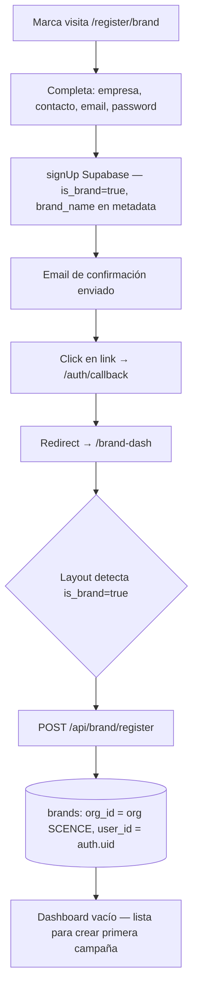
```mermaid
flowchart TD
    A["Marca visita /register/brand"] --> B["Completa: empresa, contacto, email, password"]
    B --> C["signUp Supabase — is_brand=true, brand_name en metadata"]
    C --> D["Email de confirmación enviado"]
    D --> E["Click en link → /auth/callback"]
    E --> F["Redirect → /brand-dash"]
    F --> G{"Layout detecta is_brand=true"}
    G --> H["POST /api/brand/register"]
    H --> I[("brands: org_id = org SCENCE, user_id = auth.uid")]
    I --> J["Dashboard vacío — lista para crear primera campaña"]
```

### B.2 Creación de campaña
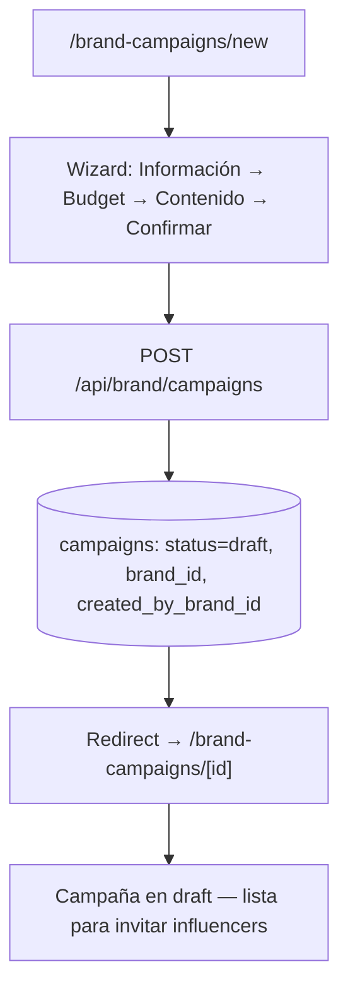
```mermaid
flowchart TD
    A["/brand-campaigns/new"] --> B["Wizard: Información → Budget → Contenido → Confirmar"]
    B --> C["POST /api/brand/campaigns"]
    C --> D[("campaigns: status=draft, brand_id, created_by_brand_id")]
    D --> E["Redirect → /brand-campaigns/[id]"]
    E --> F["Campaña en draft — lista para invitar influencers"]
```

### B.3 Invitación influencer (campaña private)
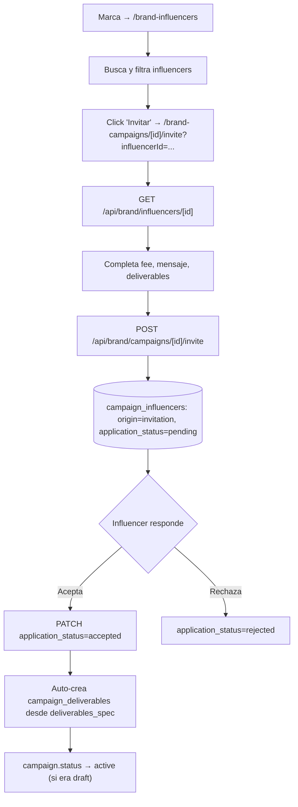
```mermaid
flowchart TD
    A["Marca → /brand-influencers"] --> B["Busca y filtra influencers"]
    B --> C["Click 'Invitar' → /brand-campaigns/[id]/invite?influencerId=..."]
    C --> D["GET /api/brand/influencers/[id]"]
    D --> E["Completa fee, mensaje, deliverables"]
    E --> F["POST /api/brand/campaigns/[id]/invite"]
    F --> G[("campaign_influencers: origin=invitation, application_status=pending")]
    G --> H{"Influencer responde"}
    H -->|Acepta| I["PATCH application_status=accepted"]
    H -->|Rechaza| J["application_status=rejected"]
    I --> K["Auto-crea campaign_deliverables desde deliverables_spec"]
    K --> L["campaign.status → active (si era draft)"]
```

### B.4 Postulación (campaña open)
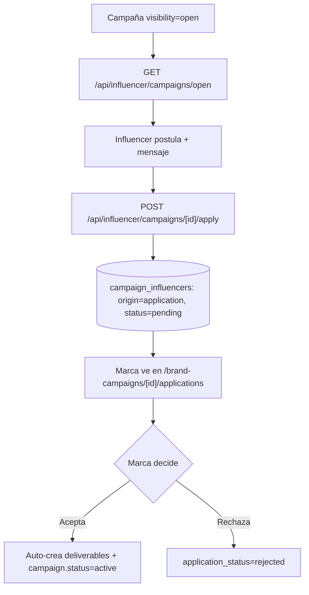
```mermaid
flowchart TD
    A["Campaña visibility=open"] --> B["GET /api/influencer/campaigns/open"]
    B --> C["Influencer postula + mensaje"]
    C --> D["POST /api/influencer/campaigns/[id]/apply"]
    D --> E[("campaign_influencers: origin=application, status=pending")]
    E --> F["Marca ve en /brand-campaigns/[id]/applications"]
    F --> G{"Marca decide"}
    G -->|Acepta| H["Auto-crea deliverables + campaign.status=active"]
    G -->|Rechaza| I["application_status=rejected"]
```

### B.5 Entrega y aprobación de deliverables
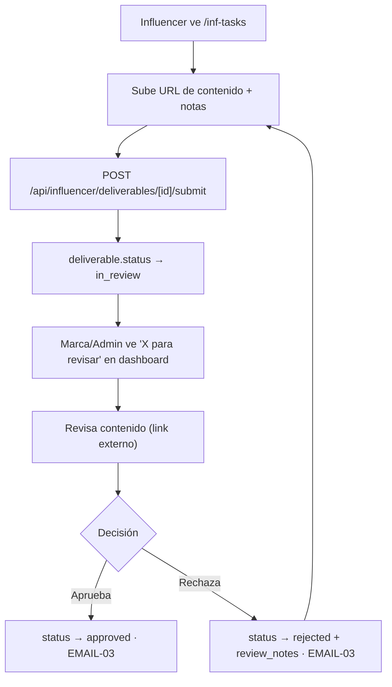
```mermaid
flowchart TD
    A["Influencer ve /inf-tasks"] --> B["Sube URL de contenido + notas"]
    B --> C["POST /api/influencer/deliverables/[id]/submit"]
    C --> D["deliverable.status → in_review"]
    D --> E["Marca/Admin ve 'X para revisar' en dashboard"]
    E --> F["Revisa contenido (link externo)"]
    F --> G{"Decisión"}
    G -->|Aprueba| H["status → approved · EMAIL-03"]
    G -->|Rechaza| I["status → rejected + review_notes · EMAIL-03"]
    I --> B
```

### B.6 Facturación
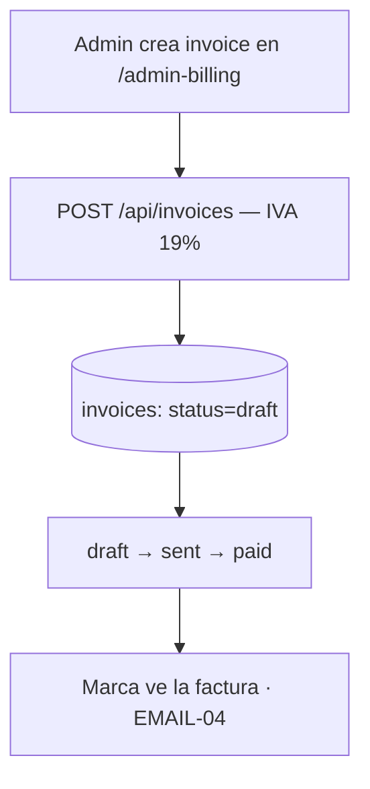
```mermaid
flowchart TD
    A["Admin crea invoice en /admin-billing"] --> B["POST /api/invoices — IVA 19%"]
    B --> C[("invoices: status=draft")]
    C --> D["draft → sent → paid"]
    D --> E["Marca ve la factura · EMAIL-04"]
```

### B.7 Payroll
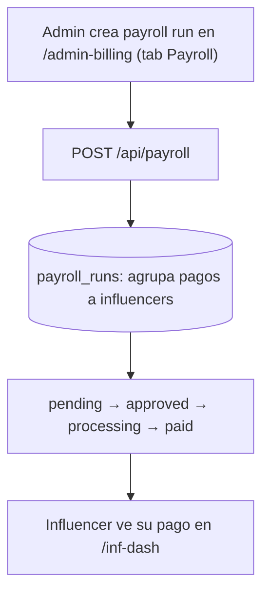
```mermaid
flowchart TD
    A["Admin crea payroll run en /admin-billing (tab Payroll)"] --> B["POST /api/payroll"]
    B --> C[("payroll_runs: agrupa pagos a influencers")]
    C --> D["pending → approved → processing → paid"]
    D --> E["Influencer ve su pago en /inf-dash"]
```

---

## 14. Anexo C — Matriz de permisos y estados

### C.1 Matriz de permisos por rol

**Nota (2026-07-01):** se elimina la columna `agency_manager` — no correspondía a ningún rol real del producto (ver BR-02 y changelog). Modelo vigente: `super_admin` (Admin, ve todo) | `brand_manager` (Brand, owner) | `influencer` (sin sub-roles).

| Recurso/Acción | super_admin | brand_manager (is_brand) | influencer (is_influencer) |
|---|---|---|---|
| Leer campaigns (todas) | ✅ | ❌ — solo propias + colaboradoras por invitación (`campaign_brands`), confirmado en `/api/brand/campaigns` | ❌ |
| Crear campaign | ✅ | ✅ | ⚠️ ver G-11 |
| Editar campaign | ✅ | ✅ (propia, pre-activa) | ❌ |
| Borrar campaign | ✅ | ❌ | ❌ |
| Leer influencers (todos) | ✅ | ✅ (limitado) | ❌ |
| Crear/editar influencer | ✅ | ❌ | ❌ |
| Invitar influencer | ✅ | ✅ | ❌ |
| Postular (aplicar) | ❌ | ❌ | ✅ |
| Aceptar/rechazar postulación | ✅ | ✅ | ❌ |
| Aceptar/rechazar invitación | ✅ (forzar) | ❌ | ✅ |
| Subir deliverable | ❌ | ❌ | ✅ |
| Aprobar deliverable | ✅ | ✅ | ❌ |
| Leer invoices | ✅ | ✅ (propias) | ❌ |
| Crear invoice | ✅ | ❌ | ❌ |
| Leer payroll | ✅ | ❌ | ✅ (propio) |
| Crear payroll | ✅ | ❌ | ❌ |
| Leer brands | ✅ | ✅ (propia) | ❌ |
| Leer analytics | ✅ | ❌ | ❌ |
| Sync Instagram | ✅ | ❌ | ❌ |

### C.2 Estados y transiciones

**Campaign.status:** `draft → pending_influencers → active ⇄ paused → completed`; `draft/active → canceled`

**application_status:** `pending → accepted / rejected / expired / withdrawn`

**Deliverable.status:** `pending → in_review → approved → published`; `in_review → rejected → in_review` (re-entrega)

**invoice_status:** `draft → sent → paid`; `sent → overdue → partially_paid`; `draft → void`

**payroll_status:** `pending → approved → processing → paid / failed`

### C.3 Gaps de producto vigentes

| Gap | Descripción | Impacto |
|---|---|---|
| G-01 | Influencer no tiene UI de "Invitaciones" separada de Campañas | Medio |
| G-02 | ~~No hay `/opportunities` dedicado...~~ **Resuelto 2026-07-01 (aclarado con Pri):** no era un gap real de construcción — crear campañas `visibility: 'open'` ya funciona en Admin (`CampaignForm.tsx`) y Marca (`CampaignFormView.brand.tsx`, real en `brand-campaigns/new`), y los influencers de la misma organización ya las ven en `inf-dash` (sección "Campañas Disponibles", vía `/api/influencer/campaigns/open`) y pueden postular. Abierta = dentro de la organización, no marketplace público entre marcas. Pri confirmó que así está bien, no se necesita página dedicada | Cerrado |
| G-06 | No hay notificaciones en tiempo real | Medio |
| G-07 | ~~`campaign_influencers.status` legacy convive con `application_status`~~ **Resuelto 2026-07-01:** era más que "conviven" — el panel de aprobación del admin usaba `status` exclusivamente (valor `'applied'` que nunca se setea), quedando completamente inoperante para postulaciones reales. Ver B-14. Unificado en `application_status` vía `src/lib/campaign-applications.ts` | Cerrado |
| G-08 | ~~Emails de invitación y de confirmación de booking no se invocan...~~ **Resuelto 2026-07-01:** conectados ambos (ver §9, EMAIL-01/02) | Cerrado |
| G-09 | No hay perfil público de influencer para marcas (`/brand-influencers/[id]`) | Bajo |
| G-10 | Sin onboarding guiado para marcas nuevas | Bajo |
| G-11 | "Campañas propias" del influencer no está en el modelo de permisos documentado | Medio — requiere decisión de producto |
| G-13 | ~~Configuración → Lugares es un stub...~~ **Resuelto 2026-07-01:** la tabla `locations` existía (RLS incluida) pero 0 endpoints la usaban — no era "conectar UI a API existente" como se pensó al inicio, había que construir el API completo. Se construyó `GET/POST /api/locations` + `PATCH/DELETE /api/locations/[id]` (org-scoped, solo `super_admin`) y la UI (lista + modal crear/editar + borrar) en `admin-settings/locations` | Cerrado |
| G-14 | ~~Duplicación de plantillas de email de booking...~~ **Resuelto 2026-07-01:** no era duplicación, eran 2 pasos de un mismo flujo (solicitud de confirmación + recibo). Se conectó el recibo (`bookingConfirmEmail`) que estaba muerto | Cerrado |
| G-15 | ~~Migraciones del repo no reflejan `brands`...~~ **Resuelto 2026-07-01:** agregada migración baseline (`20260701000001_baseline_brands_table.sql`) documentando columnas, constraints, índices y RLS reales de `brands`, sin tocar producción (tabla ya existe ahí). **Hallazgo nuevo durante esta tarea (no corregido, requiere aprobación aparte):** las 4 RLS policies de `brands` comparan `organization_id` contra una subquery que también selecciona `brands.organization_id` (no `profiles.organization_id`, columna que no existe) — la condición es tautológica y en la práctica no filtra por organización a nivel RLS. Bajo riesgo real hoy porque las 20 rutas que tocan `brands` usan `createAdminClient()` (service role, bypassea RLS) con su propia lógica de autorización — pero es una brecha de defensa en profundidad si algo llega a consultar `brands` desde el browser con la key anon/authenticated | Cerrado (baseline). RLS de `brands` queda como hallazgo de seguridad pendiente de decisión — ver nota. |
| G-16 | ~~`CampaignDetailView.tsx` soporta `mode="brand"`...~~ **Resuelto 2026-07-01:** confirmado por grep que ninguna ruta real usaba `mode="brand"` (Marca usa `CampaignDetail` directo). Se eliminó la rama y el archivo `CampaignDetailView.brand.tsx`, validado con script exhaustivo de imports (0 rotos) + `tsc --noEmit` (0 errores) antes de commitear | Cerrado |

---

*Fin del documento — SCENCE FDD v2.1, 2026-07-01.*
