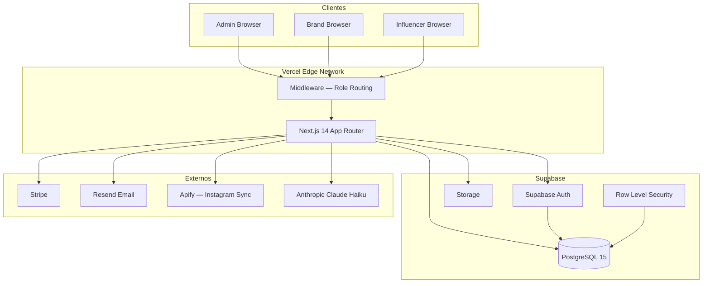

# SCENCE — Solution Design Document (SDD)
**Versión:** 1.0 | **Fecha:** 2026-06-03

---

## 1. Arquitectura general



---

## 2. Arquitectura Frontend

### Framework y rendering
- **Next.js 14** con App Router
- **Server Components** para páginas (fetch en servidor)
- **Client Components** (`'use client'`) para toda la UI interactiva
- **Estrategia actual:** Todos los componentes de UI son Client Components — fetching via `fetch()` desde el cliente hacia API routes propias

### Estructura de archivos frontend

```
src/
  app/
    (auth)/           ← Route group auth — layout sin sidebar
    (dashboard)/      ← Portal Admin — layout con sidebar
    (brand)/          ← Portal Marca — layout con header nav
    (influencer)/     ← Portal Influencer — layout con sidebar mobile
    api/              ← API Routes (Next.js API)
  components/
    campaigns/        ← AICampaignBuilder, CampaignFilters, CampaignStatusBadge
    influencers/      ← BulkUploadModal, InfluencerCard, InfluencerFilters, InfluencerTable
    layout/           ← Sidebar
    maps/             ← GoogleMap
    providers/        ← QueryProvider (TanStack Query)
  hooks/              ← Custom hooks con TanStack Query
  lib/                ← Utilidades, clients de servicios externos
  types/              ← TypeScript types globales
  middleware.ts       ← Edge middleware para routing por rol
```

### Estado y data fetching
- **TanStack Query (React Query)** para caching y re-fetching
- Hooks custom en `src/hooks/`: `useDashboard`, `useCampaignsList`, `useInfluencers`, `useBilling`, `useBookings`
- Los hooks hacen `fetch()` a las API routes propias (`/api/*`)
- Sin estado global (no Redux, no Zustand) — estado local con `useState` + TanStack Query

### UI Components
- **Tailwind CSS** para estilos
- **shadcn/ui** para componentes base (Button, Input, Select, etc.)
- **Lucide React** para iconografía
- **Recharts** para gráficas (dashboard y analytics)
- **Sonner** para toasts/notificaciones

---

## 3. Arquitectura Backend

### API Routes (Next.js)
Todas las operaciones de datos pasan por API Routes en `src/app/api/`. No hay lógica de negocio en los Client Components.

**Patrón estándar en cada API route:**
```typescript
// 1. Verificar auth con createServerClient()
const { data: { user } } = await supabase.auth.getUser()
if (!user) return 401

// 2. Obtener org_id
const orgId = await getOrgId(user.id, user.user_metadata, admin)

// 3. Query con createAdminClient() — bypasa RLS, filtra por org_id
const { data } = await admin.from('table').select('...').eq('organization_id', orgId)
```

### Namespacing de APIs

| Prefijo | Propósito |
|---|---|
| `/api/campaigns/*` | CRUD campañas — admin |
| `/api/influencers/*` | CRUD influencers — admin |
| `/api/brands/*` | CRUD brands — admin |
| `/api/brand/*` | Portal Marca — scoped por brand.user_id |
| `/api/influencer/*` | Portal Influencer — scoped por influencers.user_id |
| `/api/invoices/*` | Facturación — admin |
| `/api/payroll/*` | Payroll — admin |
| `/api/bookings/*` | Bookings — admin |
| `/api/analytics/*` | Analytics — admin |
| `/api/dashboard/*` | Dashboard KPIs — admin |
| `/api/settings/*` | Settings — admin |
| `/api/me/*` | Perfil propio — cualquier usuario |
| `/api/stripe/*` | Webhooks Stripe |
| `/api/emails/*` | Envío de emails |
| `/api/tickets/*` | Bug tracker |
| `/api/track/*` | Affiliate link tracking |

### Librerías server-side
- `@supabase/ssr` — Supabase con SSR/Server Components
- `date-fns` — manipulación de fechas
- `stripe` — Stripe SDK
- `resend` — Resend SDK para emails
- `zod` (implícito via react-hook-form) — validación en cliente

---

## 4. Arquitectura Supabase

### Instancia
- **Project ID:** `xzzbishzfyovrladcaeb`
- **Region:** us-east-1 (inferido)
- **PostgreSQL:** 15

### Clients

| Client | Key | Uso |
|---|---|---|
| `createServerClient()` | ANON_KEY | Verificar sesión del usuario en API routes |
| `createAdminClient()` | SERVICE_ROLE_KEY | Queries de datos — bypasa RLS |
| `createBrowserClient()` | ANON_KEY | Operaciones auth en cliente (login, logout, signUp) |

**Regla crítica:** Nunca usar `createServerClient()` para queries de datos. Solo para `auth.getUser()`. Los datos siempre vía `createAdminClient()` con filtro `organization_id`.

### Storage
- Buckets: no especificados en el código (referencias a `storage_path` en `media_files`)
- Usado para avatares, contenido de deliverables (via URLs externas en la práctica)

---

## 5. Arquitectura Auth

### Proveedores habilitados
- **Email + Password** (registro y login)
- **Magic Link** (para invitaciones de marca admin → brand user)

### Flujo de sesión
```
signUp / signIn
    ↓
Supabase Auth genera JWT
    ↓
Callback: /auth/callback?code=xxx
    ↓
exchangeCodeForSession()
    ↓
Redirect por rol (middleware lo detecta en siguiente request)
```

### Metadata en JWT (user_metadata)
| Campo | Tipo | Descripción |
|---|---|---|
| `organization_id` | UUID | ID de la org — resuelto por `getOrgId()` |
| `organization_name` | string | Nombre de la org (en registro) |
| `full_name` | string | Nombre del usuario |
| `is_brand` | boolean | True si es usuario de portal de marca |
| `brand_id` | UUID | ID de la brand (set en invitación admin) |
| `brand_name` | string | Nombre de la marca (en registro self-service) |
| `is_influencer` | boolean | True si es usuario de portal influencer |

### Roles (organization_members.role ENUM)
`super_admin | agency_manager | brand_manager | finance | influencer`

### Auto-provision de organización
Función `ensureOrg()` en `src/lib/supabase/ensureOrg.ts`:
- En el primer login de un usuario admin/agencia, crea automáticamente una `organization` y agrega al usuario como `owner`
- Para brand users: `POST /api/brand/register` crea el registro en `brands` table

---

## 6. Arquitectura Portal Admin

### Route group: `(dashboard)`
Layout: `src/app/(dashboard)/layout.tsx`  
Sidebar: `src/components/layout/Sidebar.tsx`

### Acceso
Solo `agency_manager` y `super_admin`. El middleware bloquea `brand_manager` e `influencer` de estas rutas.

### Patrón de componentes
Cada módulo tiene:
- `page.tsx` — Server Component, mínimo (solo wrapper)
- `[Módulo]Client.tsx` — Client Component con toda la lógica de UI y fetch

Ejemplo:
```
/campaigns/page.tsx → <CampaignsClient />
/campaigns/CampaignsClient.tsx → useState + fetch + render
```

---

## 7. Arquitectura Portal Marca

### Route group: `(brand)`
Layout: `src/app/(brand)/layout.tsx`  
Rutas base: `/brand/*`

### Acceso
Solo usuarios con `is_brand=true` en user_metadata. Middleware redirige al dashboard de marca al hacer login.

### Scoping de datos
```typescript
// Todo empieza por encontrar la brand del usuario
const { data: brand } = await admin
  .from('brands')
  .select('id, organization_id')
  .eq('user_id', user.id)
  .single()

// Luego se filtra todo por brand.id
await admin.from('campaigns').select('...').eq('brand_id', brand.id)
```

### Auto-setup
El layout llama `POST /api/brand/register` en el primer montaje (via `useRef` para evitar llamadas duplicadas). Crea el registro en `brands` si no existe.

---

## 8. Arquitectura Portal Influencer

### Route group: `(influencer)`
Layout: `src/app/(influencer)/layout.tsx`  
Sidebar: `src/app/(influencer)/_components/InfluencerSidebar.tsx`  
Nav mobile: `src/app/(influencer)/_components/InfluencerNav.tsx`

### Acceso
Solo usuarios con `is_influencer=true`. El middleware redirige a `/dashboard` al hacer login.

### Scoping de datos
```typescript
const { data: influencer } = await admin
  .from('influencers')
  .select('id, organization_id')
  .eq('user_id', user.id)
  .single()

// Luego se filtra por influencer.id
await admin.from('campaign_deliverables').select('...').eq('influencer_id', influencer.id)
```

---

## 9. Middleware

Archivo: `src/middleware.ts`

### Responsabilidades
1. **Autenticación:** Redirige usuarios no autenticados a `/login`
2. **API 401:** API routes sin auth retornan JSON `{ error: 'Unauthorized' }` en lugar de redirect HTML
3. **Routing por rol:**
   - `is_brand=true` → solo accede a `/brand/*`
   - `is_influencer=true` → solo accede a `/dashboard`, `/tasks`, etc.
   - Admin → accede a todo excepto portales de marca/influencer

### Matcher
```javascript
matcher: ['/((?!_next/static|_next/image|favicon.ico|.*\\.(?:svg|png|jpg|jpeg|gif|webp)$).*)']
```
Aplica a todas las rutas excepto assets estáticos.

### Rutas públicas
`/login`, `/register`, `/forgot-password`, `/reset-password`, `/auth/callback`, `/terms`, `/privacy`, `/api/stripe/webhook`

---

## 10. Seguridad

### Autenticación
- JWT via Supabase Auth (HttpOnly cookies, SSR-safe con `@supabase/ssr`)
- Tokens se refrescan automáticamente via `supabaseResponse` en el middleware

### Autorización
- **Nivel middleware:** bloquea acceso a portales incorrectos por rol
- **Nivel API route:** cada route verifica `user.user_metadata` para rol específico
- **Nivel DB:** `createAdminClient()` + filtro `organization_id` en cada query
- **RLS:** habilitado en tablas principales como segunda línea de defensa

### Secretos
- Variables de entorno en Vercel (nunca en código)
- `SUPABASE_SERVICE_ROLE_KEY` — solo en server-side, nunca al cliente
- Stripe webhook verificado por signature (`stripe.webhooks.constructEvent`)

### Riesgos de seguridad conocidos
- Brand users pueden ver influencers de toda la org — está diseñado así, pero revisar si se desea mayor aislamiento
- `createAdminClient()` bypasa RLS — depende de los filtros del código. Un bug en un filtro expone datos cross-org.

---

## 11. Escalabilidad

### Actual
- **Vercel** auto-escala serverless functions (API routes)
- **Supabase** maneja conexiones con pgBouncer
- **Paginación** en influencers (48/página server-side) y catálogo de marca (24/página)

### Cuellos de botella conocidos
1. **Analytics:** Hace múltiples queries paralelas (Promise.all de 5+), puede ser lento con muchos datos → considerar views o materialized views en Postgres
2. **Revenue chart:** Loop de 6 queries sincrónicamente para cada mes → paralelizado con `Promise.all` (ok)
3. **Bulk import:** Límite de 1500 influencers por lote. Con más, hacer streaming o jobs en background.

### Recomendaciones futuras
- Agregar índices en `campaign_deliverables.influencer_id` (ya existe) y `campaign_influencers.application_status` (ya creado)
- Considerar Redis/Upstash para caching de analytics
- Supabase Edge Functions para auto-notificaciones (reemplazar lógica en API routes)

---

## 12. Performance

### Optimizaciones actuales
- TanStack Query: caching de requests, refetch on window focus
- Paginación server-side en influencers
- Debounce de 300ms en búsqueda de influencers
- `force-dynamic` en `/brand/influencers` para evitar static generation errónea
- Lazy loading de Stripe y Resend (instanciados solo al primer request)

### Métricas objetivo (no medidas aún)
- Dashboard carga < 2s
- Catálogo influencers < 1.5s
- Build Vercel < 3 minutos

---

## 13. Riesgos técnicos

| Riesgo | Probabilidad | Impacto | Mitigación |
|---|---|---|---|
| Bug en filtro `organization_id` expone datos cross-org | Baja | Alto | Code review de cada API route, tests de integración |
| `campaign_influencers.status` ENUM y `application_status` desincronizados | Media | Medio | Deprecar ENUM en sprint futuro |
| `createAdminClient()` usado en Client Components (via leak accidental) | Baja | Alto | Solo en archivos `route.ts`, nunca en `.tsx` |
| `ensureOrg()` falla silenciosamente en primer login | Media | Medio | Agregar error boundary en layout |
| Apify rate limit en sync masivo de Instagram | Media | Bajo | El sync es manual, no automático |

---

## 14. Deuda técnica

| Item | Descripción | Prioridad |
|---|---|---|
| DT-01 | `campaign_influencers.status` ENUM legacy convive con `application_status` | Alta |
| DT-02 | 0% test coverage (unit y integration) | Alta |
| DT-03 | No hay error boundaries en portales | Media |
| DT-04 | `useSearchParams` en `/brand/influencers` usa `window.location` (no compatible con SSR puro) | Media |
| DT-05 | Emails Resend no se envían en flujo de invitación marca→influencer | Media |
| DT-06 | No hay logging estructurado (solo `console.error`) | Baja |
| DT-07 | `MIGRATIONS_*.sql` files en raíz del repo — deberían estar en `supabase/migrations/` | Baja |
| DT-08 | Varios API routes no validan body con Zod (validación manual) | Baja |

---

## 15. Roadmap técnico

### Sprint 1 (inmediato)
- Fix build de Fase B (resolver error `npm run build`)
- Implementar `/invitations` y `/opportunities` en portal influencer
- Email auto-send en `POST /api/brand/campaigns/[id]/invite`
- Deprecar `campaign_influencers.status` ENUM

### Sprint 2
- `/brand/campaigns` lista dedicada
- `/brand/billing` y `/brand/profile`
- Tests unitarios para APIs críticas (invite, apply, review)

### Sprint 3
- Stripe checkout para suscripción SaaS
- Notificaciones in-app persistentes
- `/brand/influencers/[id]` perfil público

### Sprint 4
- Supabase Edge Functions para notificaciones en tiempo real
- Analytics con filtros de fecha
- Mobile responsive QA
